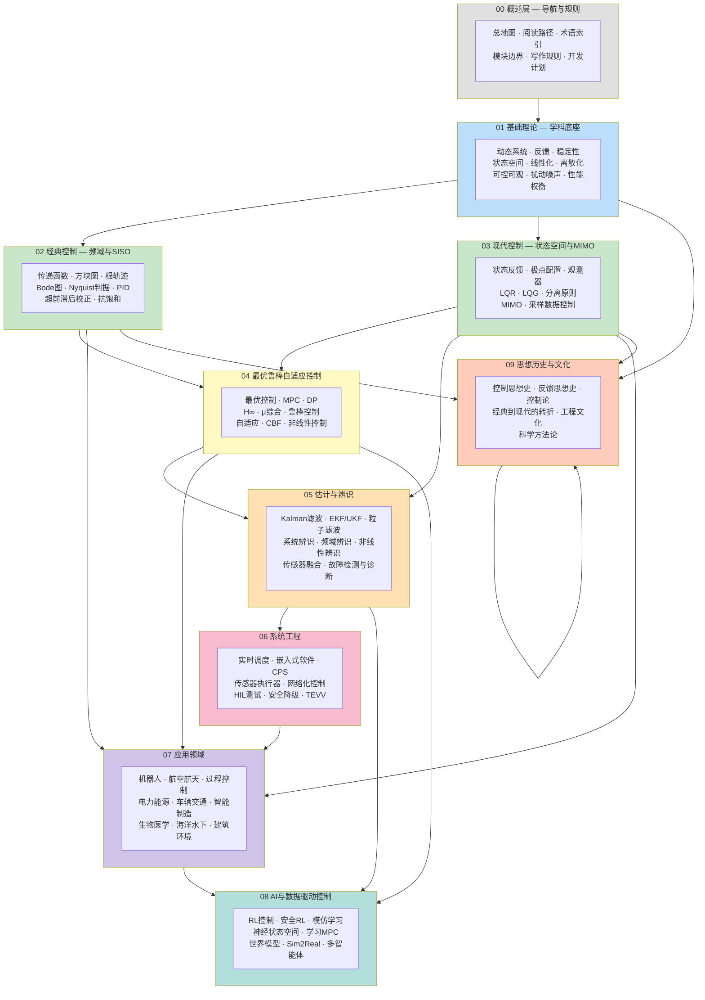

# 控制科学与工程总地图

## 控制科学可以先看成什么?

控制科学与工程的核心不是"让机器动起来"，而是让动态系统在反馈作用下按照可解释、可验证、可部署的方式运行。

一个最小控制问题通常包含：

- 被控对象：系统本身如何随时间演化；
- 传感器：系统状态如何被观测；
- 控制器：根据目标和反馈如何生成输入；
- 执行器：控制输入如何作用到系统；
- 扰动与不确定性：现实环境如何破坏理想模型；
- 性能与约束：什么叫"好"，什么叫"不能越界"。

## 学科全景

## 主骨架

### 00 总览与施工规则

- [奠基工作索引](./奠基工作索引.md)
- [知识库说明](./知识库说明.md)
- [阅读路径](./阅读路径.md)
- [模块划分范围](./模块划分范围.md)
- [边界与写作规则](./边界与写作规则.md)
- [完全态目录远景规划](./完全态目录远景.md)
- [开发计划](./开发计划.md)

### 01 基础理论

- [控制基础理论概览](../01-基础理论/控制基础理论概览.md)
- [动态系统](../01-基础理论/动态系统.md)
- [反馈](../01-基础理论/反馈.md)
- [稳定性](../01-基础理论/稳定性.md)
- [状态空间系统](../01-基础理论/状态空间系统.md)
- [平衡点与线性化](../01-基础理论/平衡点与线性化.md)
- [可控性与可观性基础](../01-基础理论/可控性与可观性基础.md)
- [采样与离散化](../01-基础理论/采样与离散化.md)
- [不确定性、扰动与噪声](../01-基础理论/不确定性扰动与噪声.md)
- [性能、约束与权衡](../01-基础理论/性能约束与权衡.md)

### 02 经典控制

- [经典控制概览](../02-经典控制/经典控制概览.md)
- [传递函数与频域方法](../02-经典控制/传递函数与频域分析.md)
- [方块图与信号流图](../02-经典控制/方块图与信号流图.md)
- [瞬态与稳态响应](../02-经典控制/瞬态与稳态响应.md)
- [PID 控制](../02-经典控制/PID控制.md)
- [根轨迹](../02-经典控制/根轨迹法.md)
- [Bode 图](../02-经典控制/Bode图.md)
- [Nyquist 判据](../02-经典控制/Nyquist判据.md)
- [超前滞后校正](../02-经典控制/超前滞后校正.md)
- [抗饱和与执行器受限](../02-经典控制/抗饱和与执行器饱和.md)

### 03 现代控制

- [现代控制概览](../03-现代控制/现代控制概览.md)
- [可控性、可观性与状态反馈](../03-现代控制/可控性可观性与状态反馈.md)
- [状态反馈与极点配置](../03-现代控制/状态反馈与极点配置.md)
- [状态观测器](../03-现代控制/状态观测器.md)
- [LQR 线性二次型调节器](../03-现代控制/LQR线性二次型调节器.md)
- [LQG 与分离原则](../03-现代控制/LQG与分离原则.md)
- [MIMO 控制概览](../03-现代控制/MIMO控制概览.md)
- [采样数据控制](../03-现代控制/采样数据控制.md)
- [线性系统理论路线图](../03-现代控制/线性系统理论路线图.md)

### 04 最优、鲁棒与自适应控制

- [高级控制概览](../04-最优鲁棒自适应控制/高级控制概览.md)
- [最优控制与模型预测控制](../04-最优鲁棒自适应控制/最优控制与MPC.md)
- [鲁棒控制与自适应控制](../04-最优鲁棒自适应控制/鲁棒与自适应控制.md)
- [动态规划与 Bellman 方程](../04-最优鲁棒自适应控制/动态规划与Bellman方程.md)
- [Pontryagin 最大值原理](../04-最优鲁棒自适应控制/Pontryagin最大值原理.md)
- [模型预测控制](../04-最优鲁棒自适应控制/模型预测控制.md)
- [H_inf 控制](../04-最优鲁棒自适应控制/H_inf控制.md)
- [自适应控制](../04-最优鲁棒自适应控制/自适应控制.md)
- [非线性控制概览](../04-最优鲁棒自适应控制/非线性控制概览.md)
- [控制 Lyapunov 函数与 CBF](../04-最优鲁棒自适应控制/控制Lyapunov函数与CBF.md)
- [分布式与分散式控制](../04-最优鲁棒自适应控制/分布式与分散式控制.md)

### 05 估计与辨识

- [估计与辨识概览](../05-估计与辨识/估计与辨识概览.md)
- [卡尔曼滤波与状态估计](../05-估计与辨识/Kalman滤波与状态估计.md)
- [系统辨识](../05-估计与辨识/系统辨识.md)
- [EKF 与 UKF](../05-估计与辨识/扩展与无迹Kalman滤波.md)
- [粒子滤波](../05-估计与辨识/粒子滤波.md)
- [滚动时域估计](../05-估计与辨识/滚动时域估计.md)
- [传感器融合](../05-估计与辨识/传感器融合.md)
- [频域辨识](../05-估计与辨识/频域辨识.md)
- [非线性系统辨识](../05-估计与辨识/非线性系统辨识.md)
- [故障检测、隔离与诊断](../05-估计与辨识/故障检测隔离与诊断.md)

### 06 系统工程

- [嵌入式、实时与信息物理控制系统](../06-系统工程/嵌入式实时与CPS控制.md)
- [实时调度与控制任务](../06-系统工程/控制实时调度.md)
- [嵌入式控制软件](../06-系统工程/嵌入式控制软件.md)
- [传感器、执行器与校准](../06-系统工程/传感器执行器与校准.md)
- [网络化控制系统](../06-系统工程/网络化控制系统.md)
- [硬件在环测试](../06-系统工程/硬件在环测试.md)
- [运行时监测与安全降级](../06-系统工程/运行时监测与安全降级.md)
- [日志、回放与审计](../06-系统工程/控制系统日志回放与审计.md)
- [TEVV 与保证案例](../06-系统工程/TEVV与保证案例.md)

### 07 应用领域

- [控制应用概览](../07-应用领域/控制应用概览.md)
- [机器人控制](../07-应用领域/机器人控制.md)
- [航空航天飞行与姿态控制](../07-应用领域/航空航天飞行与姿态控制.md)
- [过程控制](../07-应用领域/过程控制.md)
- [电力与能源系统控制](../07-应用领域/电力与能源系统控制.md)
- [车辆与交通控制](../07-应用领域/车辆与交通控制.md)
- [智能制造控制](../07-应用领域/智能制造控制.md)
- [生物医学控制](../07-应用领域/生物医学控制.md)
- [海洋与水下系统控制](../07-应用领域/海洋与水下系统控制.md)
- [建筑与环境控制](../07-应用领域/建筑与环境控制.md)

### 08 AI 与数据驱动控制

- [控制与 AI 的接口](../08-AI与数据驱动控制/控制与AI的接口.md)
- [学习增强模型预测控制](../08-AI与数据驱动控制/学习增强模型预测控制.md)
- [神经状态空间模型](../08-AI与数据驱动控制/神经状态空间模型.md)
- [强化学习与最优控制](../08-AI与数据驱动控制/强化学习与最优控制.md)
- [安全强化学习与控制](../08-AI与数据驱动控制/安全强化学习与控制.md)
- [模仿学习与控制](../08-AI与数据驱动控制/模仿学习与控制.md)
- [世界模型与控制](../08-AI与数据驱动控制/世界模型与控制.md)
- [Sim2Real 与闭环验证](../08-AI与数据驱动控制/Sim2Real与闭环验证.md)
- [多智能体学习与协同控制](../08-AI与数据驱动控制/多智能体学习与协同控制.md)
- [学习型控制系统的验证](../08-AI与数据驱动控制/学习型控制系统验证.md)

### 09 思想史与文化

- [控制科学思想史](../09-思想历史与文化/控制科学思想史.md)
- [反馈思想史](../09-思想历史与文化/反馈思想史.md)
- [控制论与控制科学](../09-思想历史与文化/控制论与控制科学.md)
- [经典到现代控制理论的历史转折](../09-思想历史与文化/经典到现代控制的转折.md)
- [航空航天与现代控制的崛起](../09-思想历史与文化/航空航天与现代控制的崛起.md)
- [裕度与稳定性的工程文化](../09-思想历史与文化/稳定裕度的工程文化.md)
- [控制科学方法论](../09-思想历史与文化/控制科学方法论.md)

### 90 附录

- [参考教材与资料](../90-附录/参考教材.md)
- [页面模板](../90-附录/页面模板.md)
- [待办清单](../90-附录/待办清单.md)
- [文献阅读路线图](../90-附录/文献阅读路线图.md)
- [课程学习路线图](../90-附录/课程学习路线图.md)
- [论文评述模板](../90-附录/论文评述模板.md)
- [仿真工具笔记](../90-附录/仿真工具笔记.md)

## 三条横向线索

### 1. 从系统到控制器

动态系统 -> 建模 -> 稳定性 -> 控制目标 -> 控制律 -> 闭环验证。

### 2. 从观测到决策

传感器 -> 状态估计 -> 不确定性 -> 预测 -> 优化 -> 控制输入。

### 3. 从理论到工程

数学证明 -> 数值算法 -> 实时实现 -> 硬件约束 -> 安全监测 -> 运行维护。

## 与其他子库的连接

- 数学子库提供分析、线性代数、优化、概率统计和数值计算底座；
- 人工智能科学子库提供学习、强化学习、世界模型、多智能体系统和安全治理接口；
- 后续工程类子库可以从控制科学继续延展到机器人、航天航空、过程工业、能源系统与交通系统。
