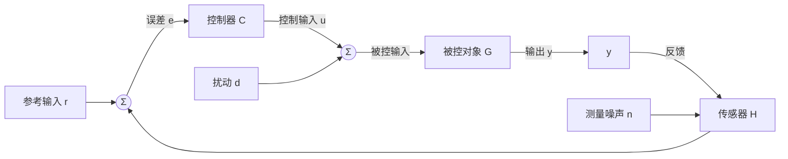

# 反馈

## 定位

反馈是控制科学的核心思想。它指系统把输出或状态信息送回控制器，用于修正下一步输入。

没有反馈，控制器只能依赖预先设定的计划；有了反馈，系统才有机会抵抗扰动、修正误差并适应模型偏差。

## 基本结构

一个最小闭环系统包含：

- 参考输入 $r$；
- 输出 $y$；
- 误差 $e=r-y$；
- 控制器 $C$；
- 被控对象 $G$；
- 传感器与执行器。

控制器根据误差或状态生成控制输入，使输出尽量满足目标。

## 灵敏度的数学分析

反馈的性能可以用灵敏度函数定量刻画。考虑标准单位负反馈结构，开环传递函数为 $L(s)=G(s)C(s)$，定义：

- **灵敏度函数**：$S(s)=\dfrac{1}{1+L(s)}$
- **补灵敏度函数**：$T(s)=\dfrac{L(s)}{1+L(s)}$

两者满足互补约束：$S(s)+T(s)=1$。

灵敏度函数 $S(s)$ 衡量闭环系统对扰动和模型不确定性的抑制能力。从输入端扰动 $d$ 到输出 $y$ 的传递函数为 $y_d(s)=S(s)G_d(s)d(s)$，其中 $G_d(s)$ 是扰动通道模型。$|S(j\omega)|<1$ 表示在该频段内扰动被衰减，$|S(j\omega)|>1$ 表示扰动被放大。

互补约束 $S+T=1$ 揭示了一个深刻事实：在任一频率上，扰动抑制能力与参考跟踪能力之和恒为1。这意味着设计者不能独立地追求两者——提升跟踪性能（$T\approx 1$）必然意味着在该频率附近扰动抑制能力减弱（$S\approx 0$），反之亦然。

## 反馈的价值

- 抑制外部扰动；
- 减小模型误差影响；
- 改善动态响应；
- 提高跟踪精度；
- 允许系统在运行中修正偏差。

## 前馈与反馈对比

| 特性 | 前馈控制 | 反馈控制 |
|------|----------|----------|
| 依据 | 扰动测量值（基于模型预测） | 误差信号（基于实际输出） |
| 响应速度 | 快，扰动影响输出前即补偿 | 慢，需等待误差出现 |
| 对模型精度要求 | 高，模型失配会降低效果 | 低，能容忍模型偏差 |
| 稳定性影响 | 不引入稳定性问题（开环） | 可能引发闭环不稳定 |
| 适用场景 | 扰动可测、模型已知、要求快速响应 | 扰动不可测、模型不确定、需要鲁棒性 |

前馈的典型优势在于补偿可预知的扰动（如负载变化、电源波动），响应快且不牺牲稳定性。其致命弱点是依赖精确模型——模型一旦失配，补偿反而会引入额外误差。反馈的典型优势在于通用性强，无论扰动来源为何，只要误差可测就能修正。其代价是必须等误差发生后才动作，且可能引入稳定性和噪声问题。

工程中两者常结合使用：前馈做快速粗调，反馈做精细修正。这种**前馈-反馈复合控制**兼顾了响应速度与鲁棒性。

## 反馈的代价

反馈不是免费午餐。

它可能带来：

- 振荡；
- 超调；
- 噪声放大；
- 延迟放大；
- 闭环不稳定；
- 执行器频繁动作。

控制设计的重要任务之一，就是在反馈增益、响应速度、抗扰能力和鲁棒性之间做权衡。

## Bode灵敏度积分（水床效应）

反馈的代价不仅是直观的，更是数学上固有的。Bode灵敏度积分定理（又称水床效应）给出了一个根本性约束：

对于开环传递函数 $L(s)$ 在右半平面无极点的最小相位系统，灵敏度函数的对数幅值在所有频率上的积分为零：

$$
\int_{0}^{\infty} \ln |S(j\omega)| \, d\omega = 0
$$

直观解释：灵敏度函数在某些频段对扰动的抑制（$|S|<1$，$\ln|S|<0$）必然在其他频段被同等"面积"的放大（$|S|>1$，$\ln|S|>0$）所补偿。如同水床——压下一个地方，另一处必然鼓起。无法在所有频率上同时获得良好的扰动抑制。

对于开环含有右半平面极点的非最小相位系统，该积分大于零，意味着"失"大于"得"——系统被迫承受更大的整体性能损失。

**设计指导意义**：Bode灵敏度积分不是工程参数可以"绕过"的约束。设计者必须审慎地选择在哪些频段优先抑制扰动（通常是低频），并接受在其他频段（通常是中高频）灵敏度被放大。这直接指导了环路 shaping 和权重函数的选择策略。

## 正反馈与负反馈

负反馈通常用于减小误差，是工程控制中的主流结构。

正反馈会放大偏差，在某些振荡器、触发器或生物系统中有用，但在一般控制系统中需要谨慎处理。

## 反馈在现代系统中的应用示例

反馈控制已渗透到各类现代工程系统中，以下是三个典型场景：

- **自动驾驶**：感知层（摄像头/激光雷达/IMU）测量车辆状态与环境信息，规划层据此生成轨迹，控制层执行转向/油门/制动指令。整个链路构成一个多层级反馈闭环——从路径跟踪的外环到底盘动力学控制的内环，反馈无处不在。传感器延迟、通信时延和执行器饱和是设计中的关键约束。

- **电网频率调节**：电网频率是发电与用电平衡的实时指标。当频率偏离50Hz（或60Hz）额定值时，调速器通过一次调频（本地比例反馈）快速响应；AGC（自动发电控制）通过二次调频（积分反馈）消除稳态偏差。电网的稳定性依赖于分层反馈结构的协同工作。

- **温度控制**：恒温器（温控器）通过温度传感器检测实际温度与设定值的偏差，按PID逻辑控制加热/制冷设备。这是最直观的反馈控制实例——尽管简单，但体现了反馈的基本原理：测量→比较→修正。

## 工程判断

设计反馈系统时，应同时检查：

- 反馈信号是否可靠；
- 采样和通信延迟是否可接受；
- 噪声是否会被控制器放大；
- 执行器是否会饱和；
- 故障时是否有安全退化路径。

此外，以下经典口诀可作为设计的快速检查清单：

- **增益越高，稳态误差越小，但稳定裕度越差**——高增益缩小误差，也逼近不稳定边界。
- **带宽越高，响应越快，但噪声放大越严重**——快速响应与噪声抑制不可兼得。
- **积分消除稳态误差，但也引入相位滞后和 windup 风险**——积分是一把双刃剑，尤其需要防范积分饱和。
- **微分预测趋势，但也放大高频噪声**——微分项需要在响应速度与噪声敏感度之间找到平衡点。

## 建议继续阅读

- [稳定性](./稳定性.md)
- [传递函数与频域方法](../02-经典控制/传递函数与频域分析.md)
- [嵌入式、实时与信息物理控制系统](../06-系统工程/嵌入式实时与CPS控制.md)
