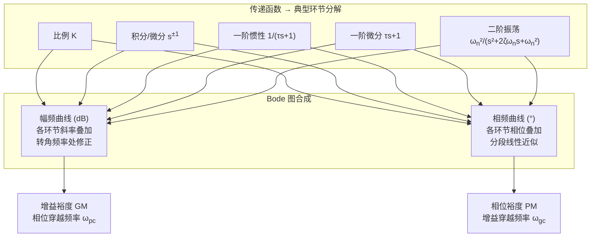

# Bode 图

## 定位

Bode 图（伯德图）是频率域分析中最基本的工具之一，由**幅频曲线**和**相频曲线**组成。横轴为频率（对数坐标），纵轴分别为幅值（dB）和相位（度）。Bode 图的优势在于：将乘法运算转化为加法运算，使复杂系统的频率特性可以通过典型环节叠加得到。

## 核心问题

控制系统的频率响应揭示了系统对不同频率输入信号的放大/衰减能力和相位偏移。核心问题包括：如何从开环频率特性判断闭环稳定性？系统的带宽是多少？在什么频率范围内扰动会被放大？Bode 图为这些问题提供了直观的图形化答案。

## 基本模型

### 典型环节的 Bode 图

**比例环节** $K$：幅频为 $20\log_{10}K$ 的水平直线；相频为 $0^\circ$（$K>0$）或 $-180^\circ$（$K<0$）。

**积分环节** $1/s$：幅频斜率为 $-20\text{ dB/dec}$，过点 $(\omega=1,\,0\text{ dB})$；相频恒为 $-90^\circ$。

**微分环节** $s$：幅频斜率为 $+20\text{ dB/dec}$；相频恒为 $+90^\circ$。

**一阶惯性环节** $1/(\tau s+1)$：低频渐近线 $0\text{ dB}$；高频渐近线 $-20\text{ dB/dec}$；转角频率 $\omega=1/\tau$ 处实际幅值比渐近线低 $3\text{ dB}$；相位从 $0^\circ$ 到 $-90^\circ$。

**一阶超前环节** $\tau s+1$：与惯性环节对称，相位从 $0^\circ$ 到 $+90^\circ$。

**二阶振荡环节** $\frac{\omega_n^2}{s^2+2\zeta\omega_n s+\omega_n^2}$：低频渐近线 $0\text{ dB}$；高频渐近线 $-40\text{ dB/dec}$；谐振频率处存在峰值，高度取决于 $\zeta$，$\zeta<0.707$ 时出现明显谐振峰。

### 渐近线近似画法

1. 将传递函数分解为典型环节
2. 确定各环节的转角频率
3. 按频率递增顺序叠加幅频斜率
4. 在转角频率处修正 $3\text{ dB}$（一阶）或谐振峰（二阶）
5. 相频曲线用分段线性近似

### 从 Bode 图读取稳定裕度

**相位裕度（phase margin, PM）**：在幅频曲线过 $0\text{ dB}$ 的频率 $\omega_{gc}$（增益穿越频率）处，相频曲线与 $-180^\circ$ 的差值：$\text{PM} = \phi(\omega_{gc}) + 180^\circ$。

**增益裕度（gain margin, GM）**：在相频曲线过 $-180^\circ$ 的频率 $\omega_{pc}$（相位穿越频率）处，幅频曲线与 $0\text{ dB}$ 的差值：$\text{GM} = -20\log_{10}|G(j\omega_{pc})|$。

典型要求：$\text{PM} > 30^\circ \sim 60^\circ$，$\text{GM} > 6\text{ dB}$。

## 关键概念

- **带宽**：$0\text{ dB}$ 穿越频率近似反映闭环带宽，带宽越大响应越快。
- **谐振峰**：幅频曲线的谐振峰反映系统对特定频率的放大程度。
- **低频增益**：决定稳态精度；低频增益越高，稳态误差越小。
- **高频衰减**：决定噪声抑制能力；高频段斜率越陡，噪声抑制越好。

## 工程判断

- **稳定性判断**：PM 和 GM 同时为正则闭环稳定（最小相位系统）。
- **校正器设计**：通过改变 Bode 图形状来满足性能指标，是超前滞后校正的基础。
- **快速性 vs 鲁棒性**：穿越频率附近斜率 $-20\text{ dB/dec}$ 时容易获得好的 PM；斜率 $-40\text{ dB/dec}$ 时稳定性差。

## 常见误区

1. **混淆开环与闭环 Bode 图**：Bode 图通常画的是开环传递函数，但稳定裕度反映的是闭环特性。
2. **忽略非最小相位系统**：PM/GM 为正仅对最小相位系统保证稳定，非最小相位系统需用 Nyquist 判据。
3. **高频段被忽略**：高频段斜率影响系统对噪声的抑制能力，不能只看穿越频率附近。
4. **dB 与线性值的转换错误**：$20\text{ dB}$ 对应 $10$ 倍，$6\text{ dB}$ 约对应 $2$ 倍。

## 与其他页面连接

- [经典控制概览](经典控制概览.md)
- [传递函数与频域方法](传递函数与频域分析.md)
- [Nyquist 判据](Nyquist判据.md)
