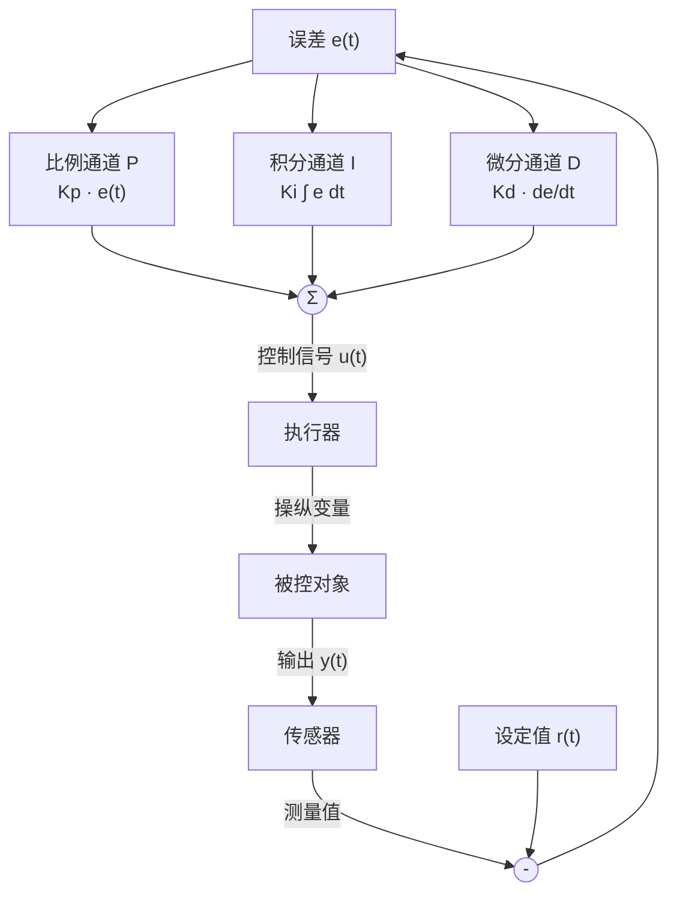

# PID 控制

## 定位

PID 控制器（proportional-integral-derivative controller）是工业界应用最广泛的反馈控制算法，占过程控制回路的 90% 以上。它将误差信号的过去（积分项）、现在（比例项）和未来趋势（微分项）结合起来产生控制信号，结构简单、参数物理意义明确、现场可调。

## 核心问题

设计控制器时的核心矛盾是：如何同时满足快速响应、消除稳态误差、抑制超调这三个相互冲突的目标？比例项提供即时修正，积分项消除残余偏差，微分项预测变化趋势以提前制动。PID 控制正是通过三个通道的协同工作来平衡这些目标。

## 基本模型

PID 控制器的理想连续形式：

$$
u(t) = K_p e(t) + K_i \int_0^t e(\tau) d\tau + K_d \frac{de(t)}{dt}
$$

或写成传递函数形式：

$$
G_c(s) = K_p + \frac{K_i}{s} + K_d s = K_p \left(1 + \frac{1}{T_i s} + T_d s\right)
$$

其中 $T_i = K_p / K_i$ 为积分时间常数，$T_d = K_d / K_p$ 为微分时间常数。

### 三通道作用详解

| 通道 | 符号 | 对响应的影响 | 对稳定性的影响 | 副作用 |
|---|---|---|---|---|
| 比例 P | $K_p$ | 加快响应，减小稳态误差 | 降低相对稳定性 | 增大超调，遗留静差 |
| 积分 I | $K_i$ | 消除稳态误差（静差） | 增加相位滞后，降低稳定性 | 使响应变慢，引起积分饱和 |
| 微分 D | $K_d$ | 预测误差变化，提前制动 | 增加阻尼，提高稳定性 | 放大高频噪声 |

## 关键概念

### PID 整定方法

1. **Ziegler-Nichols 法**：仅用比例控制使系统临界振荡，记录临界增益 $K_u$ 和临界周期 $T_u$，按经验公式计算参数。
2. **Cohen-Coon 法**：适用于自衡过程，基于一阶加纯滞后（FOPDT）模型。
3. **试凑法**：工程中最常用。先调 P 至响应灵敏但不过度振荡，再加 I 消除静差，最后加 D 抑制超调。
4. **基于优化的整定**：如 ITAE（integral of time multiplied absolute error）最优、IMC（internal model control）等。

### 积分饱和与 Anti-Windup

积分饱和（integral windup）是 PID 控制器在实际中最重要的陷阱。当执行器饱和时，误差持续存在，积分项持续累积至很大的值。当误差反向时，积分项需要长时间退饱和，导致大幅超调和缓慢调节。

常见 anti-windup 方法：
- **条件积分（conditional integration）**：饱和时冻结积分更新。
- **反馈积分（back-calculation）**：将实际控制量与控制器输出之差反馈回积分器输入端。
- **限幅积分（clamping）**：对积分项输出单独限幅。

## 工程判断

- **何时不用 D**：测量噪声大的场合（如流量控制）不宜使用微分，可用 PI 控制代替。
- **何时不用 I**：系统本身已含积分环节（如液位控制中的"自积分"过程），或存在积分饱和风险时。
- **采样周期的选择**：数字 PID 的采样周期应小于系统中最快时间常数的 1/10，否则离散化误差显著。
- **微分先行的结构**：理想 PID 的微分作用在误差突变时会产生脉冲尖峰，实际中常将微分作用移到反馈路径上（微分先行）。

## 常见误区

1. **认为 PID 是万能药**：PID 对纯延迟系统效果很差——延迟越大，P 和 D 越受限。大延迟时需用 Smith 预估器或 MPC。
2. **过度追求积分增益**：$K_i$ 过大会引起"积分振荡"，系统响应出现低频慢速振荡。
3. **忽略执行器饱和的影响**：仿真中参数完美，现场调试时因执行器饱和导致系统不稳定——这是理论与工程脱节最常见的原因之一。
4. **D 参数整定不当放大噪声**：将 D 设得过大，高频噪声被放大，执行器剧烈抖动。

## 与其他页面连接

- [经典控制概览](经典控制概览.md)
- [瞬态与稳态响应](瞬态与稳态响应.md)
- [抗饱和与执行器受限](抗饱和与执行器饱和.md)
