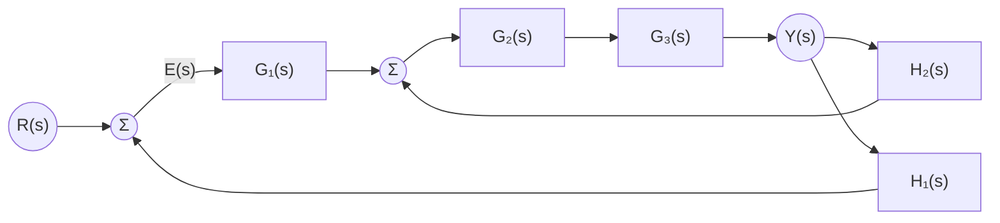

# 方块图与信号流图

## 定位

方块图（block diagram）和信号流图（signal flow graph）是经典控制理论中描述系统结构的两大图形化工具。它们将物理系统的微分方程或传递函数关系转化为直观的拓扑结构，为进一步的稳定性分析、时域响应计算和控制器设计提供基础。

## 核心问题

实际控制系统通常由多个子系统互联而成：传感器、控制器、执行器、被控对象等以串联、并联或反馈方式连接。核心问题是：如何将一个复杂的多回路系统简化为一个等效的传递函数，从而能够用统一的数学模型进行分析？方块图化简和 Mason 增益公式正是为解决这一问题而设计。

## 基本模型

### 方块图基本元素

- **方框（block）**：表示一个子系统或环节，内含传递函数 $G(s)$，输入输出关系为 $Y(s) = G(s)U(s)$。
- **求和点（summing junction）**：表示信号的代数相加，圆圈内写"$+$""$-$"号。
- **分支点（pickoff point）**：同一信号分出多条支路，信号值不变。

### 三种基本连接的化简

1. **串联**：$G_{\text{eq}} = G_1(s)G_2(s)$
2. **并联**：$G_{\text{eq}} = G_1(s) \pm G_2(s)$
3. **反馈连接**：$\displaystyle \frac{Y(s)}{R(s)} = \frac{G(s)}{1 \mp G(s)H(s)}$，其中负反馈取 $+$，正反馈取 $-$。

### 信号流图与 Mason 增益公式

信号流图用节点（node）表示变量、有向支路（branch）表示传递关系。Mason 增益公式直接给出输入到输出的总传递函数：

$$
T(s) = \frac{\sum_{k} P_k \Delta_k}{\Delta}
$$

其中：
- $P_k$：第 $k$ 条前向通路增益
- $\Delta = 1 - \sum L_i + \sum L_i L_j - \sum L_i L_j L_k + \cdots$（系统特征式）
- $L_i$：各回路增益
- $\Delta_k$：去掉与第 $k$ 条前向通路接触的所有回路后的余子式

## 典型多回路系统化简示例

以下是一个含内环和外环的双回路控制系统：

化简策略：先化简内环 $G_2, G_3, H_2$ 得到等效传递函数 $G_{23}(s)=\frac{G_2 G_3}{1+G_2 G_3 H_2}$，再化简外环。

## 关键概念

- **回路（loop）**：信号沿支路方向闭合的路径。反馈回路是控制系统的核心结构。
- **前向通路（forward path）**：从输入到输出且不经过同一节点两次的路径。
- **互不接触（non-touching）**：两个回路之间没有共享节点或支路，在计算 $\Delta$ 时需考虑其乘积项。
- **特征多项式**：$\Delta(s) = 0$ 即系统的特征方程，其根决定系统稳定性。

## 工程判断

- **化简策略**：先合并串联/并联，再处理内环反馈，由内向外逐层化简。避免"一步到位"导致的代数错误。
- **Mason 公式的适用场景**：当系统有多个交叉回路或前向通路时，方块图化简过程繁琐易错，Mason 公式可直接写出传递函数。
- **求和点与分支点的移动**：实际化简中常需要跨越方框移动求和点或分支点，应遵循"移动后等效"原则，必要时引入补偿环节。

## 常见误区

1. **反馈连接符号混淆**：负反馈的闭环分母为 $1 + GH$，正反馈为 $1 - GH$，初学者容易记反。
2. **遗漏互不接触回路**：在用 Mason 公式时，只算了 $\sum L_i$，却遗漏了 $\sum L_i L_j$ 等高阶项。
3. **多余的化简步骤**：部分系统直接用 Mason 公式比反复移动求和点更高效，不必强行化简到单一方框。

## 与其他页面连接

- [经典控制概览](经典控制概览.md)
- [传递函数与频域方法](传递函数与频域分析.md)
