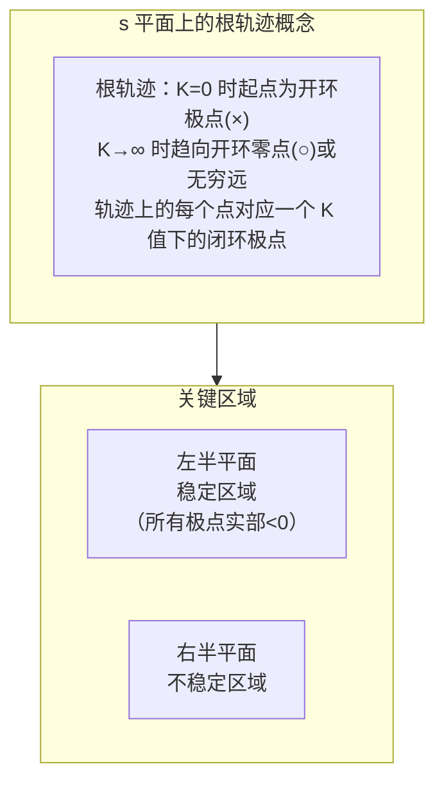

# 根轨迹

## 定位

根轨迹法（root locus method）是 W. R. Evans 在 1948 年提出的经典控制分析与设计方法。它绘制出**闭环极点随开环增益 $K$ 变化的轨迹**，直观展示系统稳定性和动态性能如何随参数变化。相比直接求解特征方程，根轨迹法提供了一整套图解规则，使工程师无需大量计算即可推断系统行为。

## 核心问题

控制器设计中最关键的一步是选择合适的增益 $K$。增益太小，响应缓慢且稳态误差大；增益太大，系统趋于振荡甚至失稳。如何在保证稳定性的前提下，选择增益使闭环极点位于满足性能指标的区域？根轨迹法从图形上回答这一问题。

## 基本模型

### 定义

设系统开环传递函数为 $G(s)H(s) = K\frac{N(s)}{D(s)}$，闭环特征方程为：

$$
1 + K\frac{N(s)}{D(s)} = 0 \quad \Longrightarrow \quad D(s) + K N(s) = 0
$$

根轨迹即闭环特征根（闭环极点）随 $K$ 从 $0 \to \infty$ 变化的轨迹。满足**幅值条件**和**相角条件**：

- 幅值条件：$|G(s)H(s)| = 1$
- 相角条件：$\angle G(s)H(s) = \pm 180^\circ(2k+1),\ k = 0, 1, 2, \dots$

### 绘制规则（8 条要点）

1. **起点与终点**：$K = 0$ 时起点在开环极点；$K \to \infty$ 时终点在开环零点或无穷远处。
2. **分支数**：等于开环极点数 $n$。
3. **对称性**：根轨迹关于实轴对称。
4. **实轴上的根轨迹**：实轴上一段右侧开环零、极点数目之和为奇数时，该段属于根轨迹。
5. **渐近线**：$n - m$ 条渐近线，与实轴的交点 $\sigma_a = (\sum\text{极点} - \sum\text{零点})/(n - m)$，角度 $\phi_a = \pm 180^\circ(2k+1)/(n - m)$。
6. **分离点（breakaway point）**：根轨迹离开或进入实轴的点，由 $dK/ds = 0$ 求解。
7. **出射/入射角**：在开环复极点处的出射角 $\theta_d = 180^\circ - \sum\angle(\text{该极点到其他极点的相角}) + \sum\angle(\text{该极点到其他零点的相角})$。
8. **与虚轴交点**：令 $s = j\omega$ 代入特征方程，求解使系统临界稳定的 $K$ 和 $\omega$。

## 关键概念

- **主导极点**：最靠近虚轴的那对共轭极点主导系统动态响应。通过根轨迹可以找到使主导极点具有所需阻尼比 $\zeta$ 的增益 $K$。
- **阻尼比线**：从原点与负实轴夹角 $\beta = \arccos\zeta$ 的射线。根轨迹与此射线的交点即满足阻尼比要求的闭环极点。
- **根轨迹校正**：通过增加开环零点或极点来"重塑"根轨迹形状：增加零点将根轨迹"向左拉"，提高快速性和稳定性；增加极点则将根轨迹"向右推"，降低稳定性。
- **参数根轨迹**：根轨迹法也适用于其他参数（如时间常数、阻尼系数）作为变量，只需将特征方程重写为 $1 + P\cdot G'(s) = 0$ 的形式。

## 工程判断

- **用根轨迹判断稳定性**：根轨迹穿越虚轴时对应的 $K$ 即为临界稳定增益。合理的工作增益应远小于该值。
- **增益的选取策略**：找到满足 $\zeta \geq 0.5$ 的 $K$ 范围，再折中考虑稳态误差要求（$K$ 越大 $e_{ss}$ 越小）。
- **零极点对消**：设计中有时增加零点消去不希望的开环极点，但实际中零极点无法精确对消，且会对不可建模的动态产生不良影响。
- **动态性能与稳态精度的权衡**：提高增益有利于稳态精度，但容易使根轨迹向右半平面移动，降低稳定性。

## 常见误区

1. **认为根轨迹只适用于增益 $K$**：实际上任何线性参数都可以作为根轨迹变量。
2. **忽略非主导极点的影响**：当增益较大时，原来远离虚轴的非主导极点可能向虚轴移动，成为主导极点。
3. **绘制时漏掉实轴区段判断**：实轴上根轨迹的"奇偶规则"是最容易出错的规则之一。
4. **认为根轨迹法已被现代方法取代**：根轨迹法在 SISO 系统的增益设计和校正中仍然是教学和工程实践的主流工具。

## 与其他页面连接

- [经典控制概览](经典控制概览.md)
- [传递函数与频域方法](传递函数与频域分析.md)
