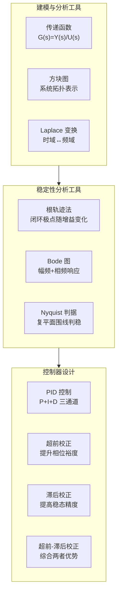

# 经典控制概览

## 定位

经典控制主要围绕输入输出关系、传递函数和频域分析展开。

它特别适合理解单输入单输出系统的响应速度、超调、稳态误差、稳定裕度和补偿器设计，是工程控制直觉的重要来源。

## 主要工具

- 传递函数；
- 方块图；
- Laplace 变换；
- 根轨迹；
- Bode 图；
- Nyquist 判据；
- PID 控制；
- 超前、滞后与超前滞后校正。

## 经典控制的设计流程

在工程实践中，经典控制的设计通常遵循一套系统化的流程，以保证设计结果满足性能指标且可工程实现。

**（1）建模与辨识**

通过物理建模（机理分析）或系统辨识（实验数据拟合）获取被控对象的传递函数。对于复杂系统，常用阶跃响应法、频率响应法或最小二乘拟合来获得近似的低阶模型。

**（2）性能指标定义**

明确控制系统的时域和频域要求，包括：
- 时域指标：上升时间、调节时间、超调量、稳态误差；
- 频域指标：带宽、相位裕度、增益裕度；
- 约束条件：控制量幅值限制、执行器速率限制等。

**（3）控制器选型**

根据被控对象特性和性能需求选择控制器结构：
- **P 控制**：适用于允许有静差的简单系统；
- **PI 控制**：消除稳态误差，适用于大多数工业过程；
- **PID 控制**：兼顾动态响应与稳态精度，最广泛使用的结构；
- **超前校正**：提升相位裕度和带宽，改善响应速度；
- **滞后校正**：降低高频增益，提高稳态精度；
- **超前-滞后校正**：综合两者优势。

**（4）参数整定与验证**

基于根轨迹法或频域法（Bode 图、Nichols 图）进行参数调整，并通过 Nyquist 判据验证闭环系统的绝对稳定性和相对稳定性。必要时使用试凑法或经验公式（如 Ziegler-Nichols 整定规则）快速获得初始参数。

**（5）工程检查与数字化实现**

在完成理论设计后，必须检查工程可实现性：
- 执行器饱和与防积分 windup 机制；
- 数字实现的采样延迟、量化误差影响；
- 传感器噪声对微分项的影响及滤波处理；
- 控制器离散化后的性能退化评估。

## 经典控制关心什么

经典控制通常从以下指标出发：

- 上升时间；
- 调节时间；
- 超调量；
- 稳态误差；
- 带宽；
- 相位裕度；
- 增益裕度；
- 抗扰能力。

### 主要指标之间的权衡关系

经典控制设计中，各项性能指标之间普遍存在矛盾关系，理解这些权衡是工程直觉的核心：

- **上升时间与超调**通常呈反比。响应越快意味着系统更"激进"，超调往往随之增大。最快的响应通常以较大的超调为代价。
- **带宽与噪声抑制**呈反比。带宽越宽，系统跟踪能力越强，但高频噪声的放大也越严重，需要在响应速度和噪声灵敏度之间找到平衡点。
- **积分增益与相位裕度**呈反比。积分作用可以消除稳态误差（提高低频增益），但会使相位滞后增加、相位裕度下降，严重时可导致系统振荡。
- **稳态精度与鲁棒性**需要折中。高增益可以提高稳态精度，但会降低系统的稳定裕度，使系统对模型不确定性和参数摄动更加敏感。

这些权衡关系决定了控制设计本质上是一个多目标优化过程，而非追求单一指标的极致。

## 为什么经典控制仍然重要

即使现代系统已经大量使用状态空间、MPC、鲁棒控制和学习控制，经典控制仍然重要，因为它提供了极强的工程直觉。

例如：

- 带宽太高会放大噪声；
- 相位裕度不足会导致振荡；
- 积分环节可以减小稳态误差，也可能带来 windup；
- 采样延迟会侵蚀稳定裕度。

### 经典控制的直觉价值

经典控制赋予工程师一种"看一眼就知道问题在哪"的能力，这种直觉在现代控制框架中并不容易直接获得：

- **Bode 图的直观性**：扫一眼幅频和相频曲线，就能快速判断系统的稳定裕度、带宽和低频增益，不需要求解复杂的矩阵方程。
- **根轨迹的增益调整方向**：根轨迹图清晰展示闭环极点随增益变化的移动趋势，一眼就能看出增益是应该增大还是减小，以及调整后系统是否会进入不稳定区域。
- **Nyquist 判据处理时滞系统**：对于含纯时滞的系统（如温度控制、远程操作），其传递函数包含 e^{-sT} 项，无法直接应用根轨迹或状态空间方法（会引入无穷维），而 Nyquist 图可以直观地用围线映射判断稳定性。
- **PID 参数的物理可解释性**：比例（P）对应当前的误差、积分（I）对应误差的累积、微分（D）对应误差的变化趋势，三个参数对应三种清晰的物理作用，理解和调试门槛远低于调节 Q/R 权重矩阵。
- **频域分析的抗扰洞察**：通过灵敏度函数和补灵敏度函数的频域形状，可以直观判断系统在哪些频率区间具有抗扰能力，哪些区间可能放大扰动。

这种直觉使经典控制方法在现场调试、故障诊断和快速原型设计中不可替代。即便是复杂的现代控制器，工程师也常用经典工具对其行为进行解释和诊断。

## 与现代控制的关系

经典控制更偏输入输出和频域，现代控制更偏状态和矩阵结构。

在实际工程中，两者常常同时使用：经典方法用于快速判断和调参，现代方法用于多变量建模、估计、优化和约束处理。

### 一个具体对比例子

考虑一个双积分系统（如直流电机的位置控制），其传递函数为 G(s) = 1/s^2。

**PID 控制方案**：工程师调节比例（P）、积分（I）、微分（D）三个增益，依靠根轨迹或 Ziegler-Nichols 整定规则获得初始参数，再通过试凑微调来平衡超调和响应速度。整个过程直观、透明，每个参数都有明确的物理含义。

**LQR 控制方案**：建立状态空间模型，选择状态权重矩阵 Q 和控制权重 R，通过求解 Riccati 方程获得最优状态反馈增益。设计者调节的是抽象的权重，Q 和 R 的相对大小决定了对状态偏差和控制代价的权衡。

**对比总结**：PID 适合单轴调参，门槛低，物理意义清晰，调试周期短；LQR 适合多变量优化，能系统性地处理状态约束和耦合，但权重调节缺乏直观的频域指导。在实际工程中，常见的做法是先用经典方法（如 PID 或超前滞后校正）获取能稳定运行的初始参数，再以此为起点用现代方法（如 LQR 或 H_inf）进行精细优化，兼顾直觉与性能。

## 建议继续阅读

- [传递函数与频域方法](./传递函数与频域分析.md)
- [反馈](../01-基础理论/反馈.md)
- [稳定性](../01-基础理论/稳定性.md)
