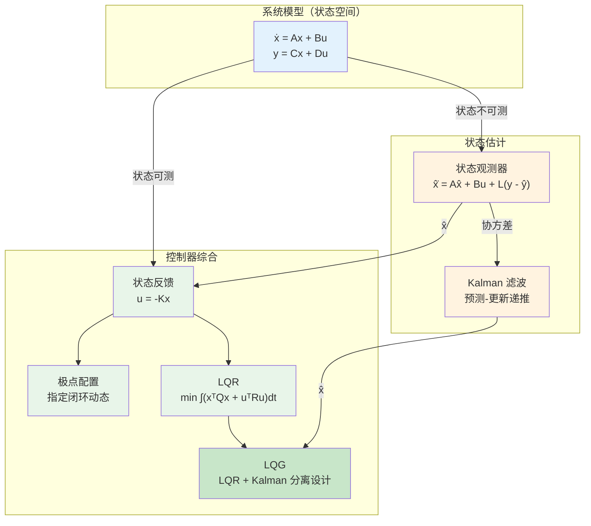

# 现代控制概览

## 定位

现代控制以状态空间为核心语言，强调系统内部状态、多变量耦合、可控性、可观性、状态反馈、观测器和最优控制。

它把控制问题从"输入输出曲线调节"推进到"系统结构分析与综合设计"。

## 从经典到现代的转变本质

现代控制相对于经典控制，在三个维度上发生了根本性转变：

**从单变量到多变量**：经典控制每个回路独立设计，对 SISO 系统有效但难以处理回路间的耦合。现代控制一次性建模所有输入与输出的耦合关系，状态空间方程天然支持多输入多输出系统，耦合不再是附加的麻烦，而是系统结构的一部分。

**从外部描述到内部描述**：传递函数只暴露输入输出关系，内部状态结构是不可见的"黑箱"。状态空间模型则显式描述每个状态变量的动态演化，让设计者可以"看到"内部结构——更重要的是，可以主动设计它。这意味着不仅能调节输出响应，还能直接操纵系统的内部动态行为。

**从试凑到优化**：经典控制通常靠经验和规则（如 Ziegler-Nichols 整定法）调试参数，依赖工程师的直觉和反复实验。现代控制把设计表达为明确的优化问题——LQR 最小化二次型代价函数，LQG 在噪声环境下求解最优控制律。这种"先定义目标，再求解增益"的思路让控制设计从手艺走向科学。

## 关键问题

- 系统是否可控；
- 系统是否可观；
- 如何通过状态反馈配置闭环极点；
- 当状态不可测时如何设计观测器；
- 如何在状态空间中构造最优控制；
- 如何处理多输入多输出系统。

## 分离原理

在现代控制框架中，状态反馈和状态估计可以独立设计。分离原理（Separation Principle）保证：如果系统是线性时不变的且满足可控可观条件，则状态反馈控制器和状态观测器可以分开设计，合并后闭环极点是控制器极点与观测器极点的联合。这是 LQG 控制的理论基石，极大简化了现代控制设计。

**工程意义**：分离原理让设计者可以在两个独立的步骤中工作——先设计理想的确定性状态反馈（假设状态已知），得到反馈增益矩阵 K；再单独设计观测器来估计状态，得到观测器增益矩阵 L。两者各自独立调参，互不干扰。最后将二者组合：u = -K hat{x}（其中 hat{x} 是观测器输出），闭环系统自然稳定。

这一原理在实际工程中意味着：**可以用"假装状态已知"的方式设计控制器，再用"假装没有控制"的方式设计估计器，两者组合仍为全局最优**。更详细的阐述参见 [LQG 与分离原则](./LQG与分离原则.md)。

## 典型方法

- 状态反馈；
- 极点配置；
- LQR；
- LQG；
- 状态观测器；
- Kalman 滤波；
- 解耦控制；
- 多变量控制。

## 现代控制的主要局限性

**需要较好的模型**：状态空间方法依赖系统模型（A, B, C, D 矩阵）。模型失配会导致状态估计偏差、反馈增益不最优，严重时甚至闭环失稳。这与 PID 的"模型要求低、在线可调"形成鲜明对比。

**计算量较大**：矩阵运算、Riccati 方程求解、Kalman 滤波的协方差更新比 PID 的简单算术复杂得多。对于高阶系统或高采样率应用，计算负载可能成为瓶颈，需要精心优化或选择降阶方法。

**对传感器要求高**：现代控制的性能很大程度上依赖于可用的测量量和估计质量。传感器噪声大、采样率低或某些关键状态完全不可观测时，状态估计精度下降，整个控制回路性能受损。

**执行器饱和**：LQR 等最优控制器设计时通常不考虑执行器幅值限制，产生的控制信号可能超出执行器能力。饱和非线性会改变系统的有效增益，导致积分饱和、极限环甚至失稳。虽然可以通过抗饱和（Anti-windup）补偿，但这超出了标准 LQR 框架。

## 相比经典控制的变化

经典控制常从传递函数和频域响应出发。

现代控制则把系统写成：

$$
\dot{x}=Ax+Bu,\qquad y=Cx+Du
$$

这使得控制设计可以直接面对系统内部结构，而不仅仅是输入输出关系。

## 现代控制的工程价值

现代控制适合处理：

- 多输入多输出系统；
- 强耦合系统；
- 状态不可直接测量的系统；
- 需要估计和控制一体化的系统；
- 航天航空、机器人、过程控制等复杂系统。

### 典型的现实应用

- **无人机姿态与位置控制**：用状态反馈（LQR 或极点配置）实现姿态镇定，Kalman 滤波融合 IMU（加速度计、陀螺仪）和 GPS 数据，获得可靠的姿态和位置估计。状态空间框架天然适应四旋翼这类 MIMO 系统的耦合动态。

- **机器人运动控制**：LQR 广泛应用于机械臂轨迹跟踪的控制问题，状态观测器用于从编码器位置测量中估计关节速度和加速度，降低对高成本的直接速度传感器依赖。双臂协调、力控制等高级任务也依赖状态空间建模。

- **过程工业 MPC**：模型预测控制（MPC）在状态空间框架下构造预测模型，利用系统当前状态（通常由状态观测器估计）预测未来输出，在线求解带约束的优化问题。这是现代控制方法在大规模过程工业（石化、化工、电力）中最成功、最广泛的应用之一。

## 建议继续阅读

- [状态空间系统](../01-基础理论/状态空间系统.md)
- [可控性、可观性与状态反馈](./可控性可观性与状态反馈.md)
- [LQG 与分离原则](./LQG与分离原则.md)
- [卡尔曼滤波与状态估计](../05-估计与辨识/Kalman滤波与状态估计.md)
