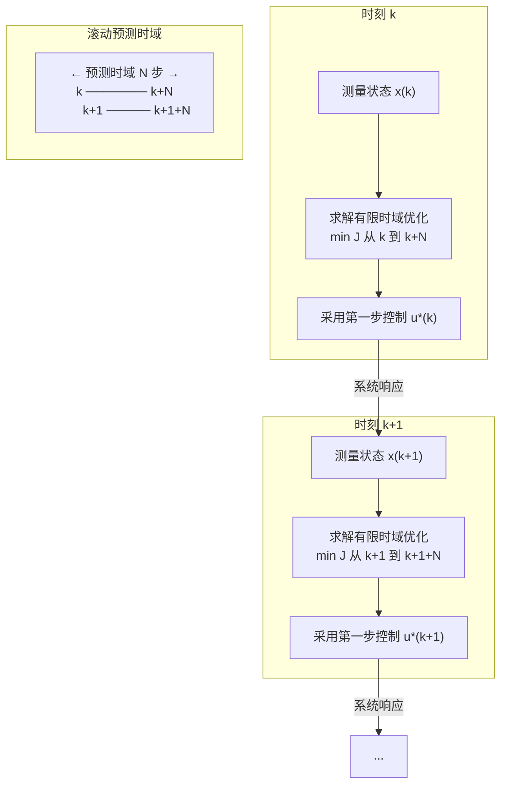

# 最优控制与模型预测控制

## 定位

最优控制和模型预测控制把控制设计放入优化框架。

它们不只问"系统是否稳定"，还问"在稳定和约束条件下，怎样做代价最低、误差最小、能耗最少或任务收益最高"。

## 为什么把控制问题表述为优化

将控制设计转化为优化问题有三个根本好处：

- **显式目标**：代价函数 $J$ 明确表达了设计者关心的性能指标（跟踪误差、能耗、执行器磨损等），不再依赖隐式的频域模板。
- **系统化权衡**：通过代价函数中的权重矩阵（如 LQR 中的 $Q$ 和 $R$），可以在多个性能指标之间做系统化的权衡。
- **约束处理**：这是优化方法相对于经典频域方法的独特优势。输入饱和、状态约束、安全距离等实际限制可以直接纳入优化问题。
- **自动化设计**：优化一旦设定，控制器的求解可由数值算法完成，避免了大量的手动调参。

## 最优控制基本形式

一个典型最优控制问题可以写作：

$$
\min_{u(\cdot)} J = \int_0^T \ell(x(t),u(t),t)dt + \phi(x(T))
$$

满足：

$$
\dot{x}=f(x,u,t)
$$

以及状态和输入约束。

## 常见方法

- 动态规划（DP）：理论上最完备，但面临"维度灾难"的指数复杂度问题。
- Pontryagin 最大值原理（PMP）：将最优控制问题转化为两点边值问题，适合连续系统。
- LQR：无限时域线性二次型调节器，是唯一有闭式解的最优控制特例。
- 直接配点法：将无限维优化离散化为 NLP 问题，用数值方法求解。
- 轨迹优化：包括打靶法、配点法、DDP/ilQR 等多种数值方法。
- 随机最优控制：在动力学或代价中包含随机性。

### LQR 的特殊地位

LQR 是实践中最有价值的最优控制特例，因为：

- **闭式解**：$K = R^{-1}B^T P$，其中 $P$ 是 Riccati 方程 $A^TP + PA - PBR^{-1}B^TP + Q = 0$ 的解。不需要迭代求解。
- **稳定性保证**：满足可控可观条件时，LQR 保证闭环稳定。
- **调参直觉**：增大 $Q$ 惩罚状态偏差，增大 $R$ 惩罚控制能量。$Q$ 和 $R$ 的相对大小决定了响应速度与能耗的权衡。
- **与 Kalman 滤波对偶**：LQR 的控制增益 $K$ 与 Kalman 滤波的观测器增益 $L$ 共享同样的 Riccati 方程结构，分别从控制器和观测器两条路径给出最优设计。

## MPC 的基本思想

MPC 在当前时刻根据模型预测未来一段时间的系统行为，求解有限时域优化问题。

执行时只采用第一步控制输入，然后在下一采样时刻重新测量状态、重新求解。

这个滚动机制使 MPC 可以持续利用反馈更新决策。

### MPC 实现的关键问题

- **求解器选择**：线性 MPC 可用二次规划（QP），非线性 MPC 需要 NLP 求解器（IPOPT、ACADOS、qpOASES 等）。求解器必须满足实时性要求。
- **预测时域 $N$**：$N$ 太小则无法预见未来约束，$N$ 太大则计算负担过重。工程经验：$N$ 应覆盖系统主导时间常数的 3-5 倍较长。
- **终端约束放松**：强制终端状态稳定可保证递归可行性，但过于保守。实践中常用终端代价近似代替严格约束。
- **计算延迟处理**：求解需要时间，有两种处理方式：一是假设延迟为采样时间的一部分，二是采用"早先解"策略（用上一时刻的优化结果的一部分控制）。
- **可行性问题**：当约束过紧导致优化不可行时，需要约束放松（soft constraints）或退回到预设安全控制器。

## MPC 的优势

- 能显式处理状态约束和输入约束；
- 适合多变量系统；
- 能纳入未来参考轨迹；
- 工程解释性较强；
- 容易与状态估计和系统辨识结合。

## MPC 的难点

- 在线优化计算量大；
- 模型误差会影响预测质量；
- 非线性和非凸约束可能导致求解困难；
- 需要处理不可行问题；
- 实时系统中必须有求解超时策略。

## 现代收敛趋势

- DDP 和 ilQR 在机器人领域已成为轨迹优化的标准工具，利用最优控制的微分结构实现高效求解。
- 学习型 MPC 将数据驱动的模型（GP、NN）嵌入 MPC 框架，用数据弥补模型误差。
- 显式 MPC 在离线阶段将整个状态空间分区，在线只需查表，适合对实时性要求极高的应用。

## 与强化学习的连接

MPC 与强化学习共享"长期代价"和"序列决策"视角，但侧重点不同。

- MPC 通常依赖显式模型和在线优化；
- 强化学习通常从数据或交互中学习策略或价值函数；
- 学习模型 + MPC 是一种常见组合；
- RL warm start MPC 或近似 MPC 策略也是重要方向。

两者正在融合：MPC 提供安全约束和稳定保证，强化学习提供从数据中学习和适应复杂环境的能力。

## 建议继续阅读

- [状态空间系统](../01-基础理论/状态空间系统.md)
- [系统辨识](../05-估计与辨识/系统辨识.md)
- [控制与 AI 的接口](../08-AI与数据驱动控制/控制与AI的接口.md)
