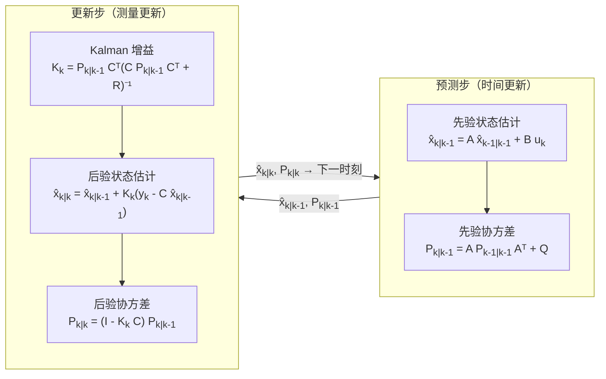

# 卡尔曼滤波与状态估计

## 定位

卡尔曼滤波是状态估计的经典方法，用于在有噪声观测下估计动态系统状态。

它在导航、机器人、航天、过程控制、传感器融合和经济系统中都有广泛应用。

## 为什么不直接使用传感器测量

实际工程中状态估计不可避免的原因包括：

- 许多重要量（如飞行器的迎角、电池的内阻）无法直接测量；
- 传感器成本高、体积大，无法全面部署；
- 传感器信号受噪声污染，直接使用会导致剧烈控制动作；
- 传感器的采样频率和延迟各不相同，需要统一的时间基准。

因此，估计器不是可选项而是必需项。Kalman 滤波提供了从含噪声测量中提取最佳状态估计的系统化方法。

## 基本问题

系统状态按模型演化：

$$
x_{k+1}=Ax_k+Bu_k+w_k
$$

传感器给出观测：

$$
y_k=Cx_k+v_k
$$

其中 $w_k$ 是过程噪声，$v_k$ 是观测噪声。

状态估计的目标是根据历史输入和观测，得到对 $x_k$ 的最佳估计。

## 工程意义：为什么 Kalman 滤波如此重要

- **最优性黄金标准**：在高斯噪声假设下，Kalman 滤波是均方误差意义下的最优估计器。所有线性估计器的最优基准。
- **不确定性量化**：Kalman 滤波不仅给出状态估计 $\hat{x}$，还给出估计误差协方差 $P$，量化了估计的可信度。
- **在线递推计算**：不需要存储全部历史数据，每次只根据上一时刻的估计和新测量更新，适合实时应用。
- **与 LQR 对偶**：Kalman 滤波的增益计算与 LQR 的增益计算共享 Riccati 方程结构。这一对偶关系意味着一个领域的工程经验可以直接迁移到另一个领域。

## 两步结构

Kalman 滤波可以理解成两步循环：

1. **预测**：用模型从上一时刻估计当前状态，不确定性增加：

$$
\hat{x}_{k|k-1} = A\hat{x}_{k-1|k-1} + Bu_k
$$
$$
P_{k|k-1} = AP_{k-1|k-1}A^T + Q
$$

2. **更新**：用当前观测修正预测结果，不确定性减小：

$$
K_k = P_{k|k-1}C^T(CP_{k|k-1}C^T + R)^{-1}
$$
$$
\hat{x}_{k|k} = \hat{x}_{k|k-1} + K_k(y_k - C\hat{x}_{k|k-1})
$$
$$
P_{k|k} = (I - K_kC)P_{k|k-1}
$$

预测依赖模型，更新依赖传感器。滤波器的关键在于根据不确定性权衡两者。

### Kalman 增益 $K$ 的行为解释

Kalman 增益 $K$ 是模型信任何传感器信任之间的动态权衡：

- 当过程噪声 $Q$ 大（模型不可靠）时，$K \to C^{-1}$，滤波器更相信测量；
- 当测量噪声 $R$ 大（传感器不可靠）时，$K \to 0$，滤波器更相信模型预测；
- 稳态时 $K$ 收敛到常值，此时滤波器进入稳态工作模式。

## 工程直觉

- 如果模型可信、观测噪声大，就更相信预测；
- 如果模型不准、传感器可靠，就更相信观测；
- 如果过程噪声被低估，滤波器会过度自信（$P$ 太小），导致更新不足；
- 如果观测噪声被低估，滤波器会追着噪声跑（$K$ 太大），估计值剧烈抖动。

### Q 和 R 调谐

Q 和 R 的取值是 Kalman 滤波工程部署中最费时的环节：

- Q 和 R 的**比值**决定了滤波器的行为，比它们的绝对值更重要；
- Q/R 比值增大 → 响应更快但噪声放大；比值减小 → 更平滑但响应滞后；
- 自调谐方法包括：利用最大似然估计从数据中确定 Q 和 R，或根据创新序列的自相关进行校验；
- 多输出系统需要交叉项，通常简化为对角矩阵，或通过实验确定各通道的相对权重。

## 常见扩展

- EKF（扩展 Kalman 滤波）：用线性化处理非线性系统，实现简单但可能发散；
- UKF（无迹 Kalman 滤波）：用 sigma points 传播非线性不确定性，精度更高且不需要解析 Jacobian；
- 粒子滤波：处理非高斯和强非线性情况，计算量最大但最通用；
- 信息滤波：用信息矩阵代替协方差矩阵，适合某些大规模或分布式估计场景；
- 平滑器：利用未来观测修正过去状态估计，提高事后分析的精度。

## 工程注意事项

- **模型误差敏感性**：Kalman 滤波假设模型是准确的。如果系统模型 A 与实际偏差太大，估计会严重偏离。解决方法是引入自适应机制或使用鲁棒 Kalman 滤波。
- **数值稳定性**：标准 Kalman 滤波更新步骤中 $P_{k|k} = (I-KC)P_{k|k-1}$ 在小数值下可能失去对称正定性。工程实践中推荐使用 Joseph 形式 $P_{k|k} = (I-KC)P_{k|k-1}(I-KC)^T + KRK^T$（始终对称正定）或平方根滤波。
- **传感器故障检测**：通过卡方检验创新序列 $y_k - C\hat{x}_{k|k-1}$，可以检测传感器是否出现故障或偏移。
- **实时计算**：标准 Kalman 滤波的计算复杂度为 $O(n^3)$（n 是状态维度），主要是矩阵求逆和乘法。对于高维系统（n > 50），需要利用稀疏性或采用分布式滤波。

## 与控制的关系

当控制器需要状态但状态不可直接测量时，估计器就成为闭环的一部分。

估计器设计不当可能导致：

- 控制延迟；
- 噪声放大；
- 错误状态反馈；
- 故障隐藏；
- 闭环性能下降。

## 建议继续阅读

- [估计与辨识概览](./估计与辨识概览.md)
- [状态空间系统](../01-基础理论/状态空间系统.md)
- [可控性、可观性与状态反馈](../03-现代控制/可控性可观性与状态反馈.md)
