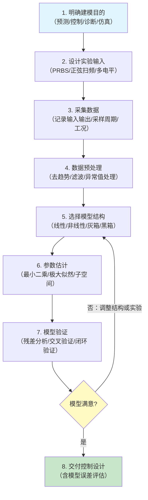

# 系统辨识

## 定位

系统辨识是从数据中建立或校准动态系统模型的方法。

在实际控制工程中，模型常常来自物理机理、实验数据、运行日志和工程经验的混合，而不是完全已知。

## 系统辨识回答什么

- 系统阶次是多少；
- 参数值是多少；
- 输入输出之间的动态关系是什么；
- 噪声和扰动如何进入系统；
- 模型在哪些工况下有效；
- 模型误差是否会影响闭环控制。

## 辨识模型的三种类型

- **白箱模型**：从物理原理（牛顿定律、热力学、电磁学）推导。结构明确、外推能力强，但需要深入的物理理解和大理的工程假设。
- **黑箱模型**：直接从输入输出数据拟合，不假设物理结构。灵活但参数缺乏物理解释，外推风险高。传递函数拟合、神经网络、ARX 模型都属于此类。
- **灰箱模型**：借用已知的结构（如一阶惯性系统），用数据拟合未知参数。这是工程中最常用的折中方案，结合了物理先验和数据驱动。

工程实践中，系统辨识往往是灰箱过程：用物理分析确定结构，用实验数据调优参数。

## 常见模型

- ARX / ARMAX 模型；
- 传递函数模型；
- 状态空间模型；
- Hammerstein-Wiener 模型；
- 非线性状态空间模型；
- 神经网络代理模型；
- Koopman 表示。

## 实验输入设计

辨识结果的可靠性很大程度上取决于数据质量。实验设计时要考虑：

- **输入信号**：必须充分激励所有感兴趣的系统动态。PRBS（伪随机二进制序列）是最常用的激励信号，因为它频谱宽、能量分布均匀，且易于实现。对非线性系统，需要多电平输入或正弦扫频。
- **采样频率**：应为系统带宽的 5-10 倍。采样过慢会丢失高频动态信息；采样过快会导致相邻样本高度相关，增加计算负担且矩阵病态。
- **数据长度**：通常需要覆盖系统主导时间常数的 5-10 倍，以确保低频动态被充分捕获。
- **开环 vs 闭环辨识**：开环辨识更简单直接，但可能偏离实际工况。闭环辨识更贴近控制应用，但输入与输出通过反馈耦合，引入相关性偏差，需要专门的闭环辨识方法（如直接法、间接法、联合输入输出法）。

## 辨识流程

1. **明确建模目的**：预测、控制、诊断还是仿真。
2. **设计实验输入**：保证数据足够激励系统。
3. **采集数据**：记录输入、输出、采样周期和工况。
4. **选择模型结构**：线性、非线性、状态空间或混合模型。
5. **估计参数**：用优化或统计方法拟合模型。
6. **验证模型**：用独立数据检查预测和闭环相关指标。
7. **进入控制设计**：评估模型误差对控制器的影响。

## 最小二乘法的几何理解

线性系统辨识的核心是最小二乘法。其几何意义可以理解为：将观测向量 $y$ 正交投影到由输入数据张成的子空间上。

- Gauss-Markov 定理指出，在满足某些条件下的最小二乘估计是所有线性无偏估计中方差最小的。
- 但最小二乘法的关键假设是噪声与输入不相关。当输入受到噪声污染（闭环辨识中的常见情况）时，最小二乘估计是有偏的。
- 工具变量法（Instrumental Variable）是处理输入噪声问题的经典方法，通过引入与噪声不相关但与系统动态相关的工具变量来消除偏置。

## 验证与模型质量评估

- **交叉验证**：用未参与辨识的数据验证模型。这是最可靠的验证方法。
- **残差分析**：检查预测残差是否近似白噪声。残差中如有显著自相关或与输入相关，说明模型未捕获全部动态。
- **闭环仿真**：将辨识模型用于控制器设计，在仿真中检查闭环性能是否满足要求。
- **适用范围标注**：辨识模型的结果必须明确标注其有效工况范围（速度、负载、温度等），超出范围的外推不可靠。

## 常见误区

### 只看开环预测误差

开环预测好，不代表闭环控制一定可靠。模型在低频段的误差可能被反馈系统放大，导致稳态精度不足。

### 忽略实验输入设计

如果数据没有充分激励关键动态，模型可能看起来拟合很好，却缺失重要模式。这是一个经典的"欠激励"问题。

### 不标注适用工况

辨识模型必须说明在哪些速度、温度、负载、扰动和控制区间内有效。模型的有效性是有边界条件的，不经验证的跨工况外推是导致控制失败的重要原因。

### 过拟合与欠拟合

- 过拟合：使用过高阶模型适配噪声，模型在训练数据上精度高但在验证数据上差。应对策略包括交叉验证、正则化（如岭回归）和 AIC/BIC 准则选择模型阶次。
- 欠拟合：使用过低阶模型，未能捕获重要动态模式。判断依据：残差分析显示系统性的自相关结构。

### 忽视采样频率

采样频率过低会导致混叠（高频成分折叠到低频），使辨识结果完全错误。采样频率过高则计算浪费且矩阵病态。

### 忽略非线性

用线性模型辨识本质非线性的系统，会导致模型只在特定工作点附近有效。工程中应先用可视化方法检查数据的非线性特征（如不同输入幅值下的响应差异），再选择模型类型。

## 与机器学习的区别

系统辨识和机器学习都从数据中学习模型，但系统辨识更强调：

- 动态结构；
- 采样和激励条件；
- 噪声建模；
- 可解释参数；
- 闭环可用性；
- 模型误差对控制器的影响。

## 建议继续阅读

- [最优控制与模型预测控制](../04-最优鲁棒自适应控制/最优控制与MPC.md)
- [控制与 AI 的接口](../08-AI与数据驱动控制/控制与AI的接口.md)
