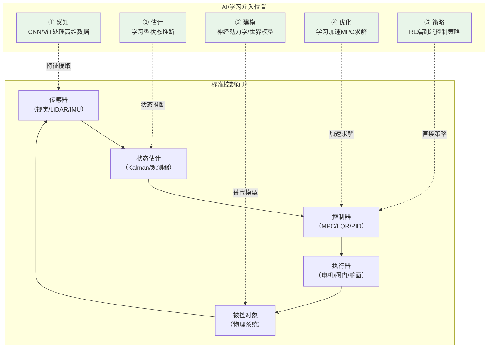

# 控制与 AI 的接口

## 定位

控制科学与人工智能不是简单的"传统方法"和"新方法"关系。

两者在动态系统、状态估计、序列决策、优化和多智能体协同上有深层交叉，但控制科学更强调闭环稳定、约束满足、鲁棒性和工程验证。

## 为什么现在控制与 AI 的交叉如此重要

三个驱动因素使这一交叉成为当前的研究热点：

1. **传感器和算力的普及**：高分辨率摄像头、激光雷达、低成本 IMU 和边缘计算设备的广泛应用，使得高维感知数据可以被实时获取并用于控制决策，传统控制理论难以直接处理此类非结构化输入。
2. **强化学习的突破性进展**：深度强化学习在游戏（AlphaGo、Dota 2、Atari）、机器人操纵和仿真环境中展示了超越传统方法的策略生成能力，引发了将此类学习方法引入实际控制系统的广泛探索。
3. **复杂系统的综合需求**：自动驾驶、服务机器人、智能电网、无人机集群等现代系统，同时面临非结构化环境感知、多约束优化、安全关键决策和实时运行的挑战。单一的传统控制或纯学习范式均难以覆盖全部需求。

这不是方法的替代关系，而是互补关系——控制提供闭环保证，AI 提供处理复杂感知和模式识别能力。

## AI 可以进入控制系统的哪些位置

### 1. 感知

把图像、点云、语音、雷达或多模态数据转成控制可用状态。

但感知延迟和误检是控制系统需要额外处理的安全隐患，必须通过滤波、冗余校验或时空一致性检查来降低其对闭环行为的影响。

### 2. 估计

估计不可测状态、环境变量、扰动、意图或系统健康状态。

但 AI 估计器需要明确的置信度输出，否则控制律无法合理处理不确定性，可能导致基于错误估计的决策放大系统风险。

### 3. 建模

学习未知动力学、残差模型、代理仿真器或世界模型。

但神经网络模型在未见区域的外推行为不可控，需要在控制设计中做鲁棒性处理，例如通过鲁棒控制理论或在线自适应机制来抑制模型偏差的影响。

### 4. 优化

加速 MPC、近似代价函数、生成候选轨迹或学习 warm start。

但 AI 加速的近似解需要满足原问题的最优性或可行性保证，否则加速带来的实时性收益将被解的次优性甚至不可行性所抵消。

### 5. 策略

直接学习从状态到动作的控制策略，例如强化学习或模仿学习。

但纯学习策略缺乏稳定性保证和约束处理能力，通常需要与基于模型的方法结合，或通过安全壳（safety shield）机制约束策略的输出空间。

### 6. 监督

做异常检测、风险评估、运行监控、安全壳和故障切换。

## 控制给 AI 提供什么

控制理论为 AI 系统提供一套硬约束语言：

- 稳定性；
- 可控性；
- 可观性；
- 鲁棒性；
- 约束满足；
- 实时性；
- 闭环验证。

这套语言可以帮助判断学习模块到底提升了系统，还是把不可控误差引入了闭环。

## AI 给控制提供什么

AI 的价值主要在于：

- 处理高维感知输入；
- 学习难以显式建模的非线性动态；
- 从大规模数据中提取模式；
- 辅助复杂任务规划；
- 在多智能体和复杂环境中学习策略；
- 提升仿真、辨识和诊断能力。

## 高风险交叉点

控制与 AI 结合时，最需要警惕：

- 开环预测好但闭环不稳定；
- 平均回报高但约束违反；
- 仿真表现好但现实迁移失败；
- 神经网络控制器不可解释且难以验证；
- 在线学习破坏已有安全裕度；
- 感知误差被控制律放大；
- **分布偏移**：学习模块在面对训练分布之外的场景时表现不可预测，这在控制闭环中可能导致级联失效——一个环节的输出偏移会逐级传递并放大，最终引发系统层面的失稳或安全性违反。

## 稳妥的系统架构

工程上更稳妥的做法通常不是让 AI 独占闭环，而是采用分层结构：

- AI 做感知、估计、建模、候选策略或辅助规划；
- 控制器负责稳定、约束和执行；
- 安全层负责监测、限幅、屏蔽和故障切换；
- 日志与回放系统负责审计和持续改进。

## 当前进展与开放问题

控制与 AI 交叉领域在多个方向取得了实质性进展：

- **学习增强 MPC**：利用神经网络在线学习残差动力学模型或代价函数中的未建模项，同时保持 MPC 的显式约束处理能力和稳定性保证。典型方法包括通过学习补偿模型预测误差、学习终端代价函数降低保守性，以及学习 warm start 加速在线求解。
- **Neural Lyapunov / Barrier Function**：通过神经网络参数化 Lyapunov 函数或控制屏障函数，为基于学习的控制器提供可验证的稳定性或安全性保证。即使策略本身是黑箱，只要存在已验证的 barrier function，就可以在运行时约束系统状态远离不安全区域。
- **Sim2Real 迁移**：通过领域随机化（在仿真中随机化物理参数、光照、纹理等）和域适应技术（对齐仿真与真实数据的特征分布），使在仿真中高效训练的策略能够成功迁移到真实系统，而无需大量真实数据重训。
- **形式化验证**：对神经网络控制器的鲁棒性验证正在从理论走向工程。区间传播（interval propagation）、SMT 求解、混合整数规划等方法可用于分析网络在小扰动下的输出范围，并逐步扩展到更大规模的网络架构。

**关键开放问题**：如何将学习模块的安全保证集成到现有控制系统工程标准中（如航空领域的 DO-178C、汽车领域的 ISO 26262）？当前的方法在理论上有进展，但在工程认证层面尚缺乏成熟路径。

## 与人工智能科学子库的连接

建议联动阅读：

- [动态系统、估计与控制：人工智能的另一条理论主线](../../人工智能科学/01-基础理论/dynamical-systems-estimation-and-control-for-ai.md)
- [人工智能与控制理论结合](../../人工智能科学/06-applications/ai-and-control-theory.md)
- [控制科学与工程中的人工智能：总论](../../人工智能科学/06-applications/control-science-and-engineering-overview.md)

## 后续专题

- 学习增强 MPC；
- 安全强化学习；
- 多智能体协同控制；
- 神经状态空间模型；
- 控制屏障函数与学习系统；
- sim2real 与闭环鲁棒性测试。
