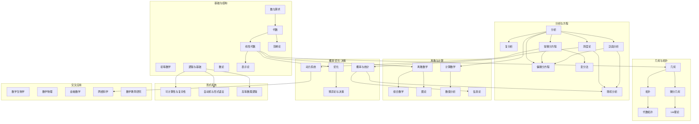

# 数学总地图

## 数学可以先看成什么

在这个子库里，数学被看成对数量、结构、空间、变化、随机性、离散对象、计算过程与决策规则的系统研究。

## 分支全景关系图

## 主要分支

- [初等数学](../01-分支/初等数学.md)
- [数与算术](../01-分支/数与算术.md)
- [代数](../01-分支/代数.md)
- [线性代数](../01-分支/线性代数.md)
- [表示论](../01-分支/表示论.md)
- [几何](../01-分支/几何.md)
- [拓扑](../01-分支/拓扑.md)
- [分析](../01-分支/分析.md)
- [测度论](../01-分支/测度论.md)
- [复分析](../01-分支/复分析.md)
- [泛函分析](../01-分支/泛函分析.md)
- [常微分方程](../01-分支/常微分方程.md)
- [偏微分方程](../01-分支/偏微分方程.md)
- [随机分析](../01-分支/随机分析.md)
- [动力系统](../01-分支/动力系统.md)
- [变分法](../01-分支/变分法.md)
- [微分几何](../01-分支/微分几何.md)
- [Lie 理论](../01-分支/Lie理论.md)
- [代数拓扑](../01-分支/代数拓扑.md)
- [概率与统计](../01-分支/概率与统计.md)
- [离散数学](../01-分支/离散数学.md)
- [组合数学](../01-分支/组合数学.md)
- [图论](../01-分支/图论.md)
- [逻辑与基础](../01-分支/逻辑与基础.md)
- [高等数理逻辑](../01-分支/高等数理逻辑.md)
- [数论](../01-分支/数论.md)
- [优化](../01-分支/优化.md)
- [计算数学](../01-分支/计算数学.md)
- [数值分析](../01-分支/数值分析.md)
- [信息论](../01-分支/信息论.md)
- [可计算性与复杂性](../01-分支/可计算性与复杂性.md)
- [自动机与形式语言](../01-分支/自动机与形式语言.md)
- [博弈论与决策](../01-分支/博弈论与决策.md)
- [范畴论](../01-分支/范畴论.md)
- [网络科学与大规模系统](../01-分支/网络科学与大规模系统.md)

## 共同骨架

这些分支反复围绕一些共同概念展开：

- [数](../02-核心概念/数.md)
- [集合](../02-核心概念/集合.md)
- [函数](../02-核心概念/函数.md)
- [结构](../02-核心概念/结构.md)
- [证明](../02-核心概念/证明.md)
- [等价关系与序](../02-核心概念/等价关系与序.md)
- [群、环与域](../02-核心概念/群环域.md)
- [Banach 空间与 Hilbert 空间](../02-核心概念/Banach空间与Hilbert空间.md)
- [Sobolev 空间](../02-核心概念/Sobolev空间.md)
- [紧算子与谱](../02-核心概念/紧算子与谱.md)
- [流形](../02-核心概念/流形.md)
- [Lie 群与 Lie 代数](../02-核心概念/Lie群与Lie代数.md)
- [熵](../02-核心概念/熵.md)
- [风险度量](../02-核心概念/风险度量.md)
- [形式系统与计算](../02-核心概念/形式系统与计算.md)
- [依赖类型](../02-核心概念/依赖类型.md)
- [高斯图模型](../02-核心概念/高斯图模型.md)
- [概率图模型](../02-核心概念/概率图模型.md)
- [因子图](../02-核心概念/因子图.md)
- [因果性与结构模型](../02-核心概念/因果与结构模型.md)
- [反事实](../02-核心概念/反事实.md)
- [动态系统](../02-核心概念/动力系统.md)
- [不变集与安全约束](../02-核心概念/不变集与安全约束.md)
- [可达性与可存活性](../02-核心概念/可达性与可存活性.md)
- [均值场](../02-核心概念/均值场.md)
- [极限与余极限](../02-核心概念/极限与余极限.md)
- [复数](../02-核心概念/复数.md)
- [序列与级数](../02-核心概念/序列与级数.md)
- [行列式](../02-核心概念/行列式.md)
- [独立性与条件独立性](../02-核心概念/独立性与条件独立.md)
- [傅里叶变换](../02-核心概念/Fourier变换.md)

## 当前已展开的高频主线

- 分析与空间线： [极限](../02-核心概念/极限.md)、[连续](../02-核心概念/连续性.md)、[导数](../02-核心概念/导数.md)、[积分](../02-核心概念/积分.md)、[测度论](../01-分支/测度论.md)、[实分析基础](../03-定理与方法/01-分析与测度/实分析基础.md)、[复分析与 Cauchy 理论](../03-定理与方法/01-分析与测度/复分析与Cauchy理论.md)、[拓扑空间](../02-核心概念/拓扑空间.md)、[度量空间](../02-核心概念/度量空间.md)、[泛函分析：Banach、Hilbert 与算子](../03-定理与方法/01-分析与测度/泛函分析Banach-Hilbert与算子.md)、[PDE、弱解与变分方法](../03-定理与方法/01-分析与测度/PDE弱解与变分方法.md)、[PDE 正则性、分布解与有限元](../03-定理与方法/01-分析与测度/PDE正则性分布与有限元.md)
- 代数与抽象结构线： [群、环与域](../02-核心概念/群环域.md)、[表示论与对称性](../03-定理与方法/02-代数与数论/表示论与对称性.md)、[范畴、函子与自然变换](../03-定理与方法/02-代数与数论/范畴函子与自然变换.md)、[Yoneda 引理、极限与余极限](../03-定理与方法/02-代数与数论/Yoneda引理极限与余极限.md)
- 概率、图模型与因果线： [条件期望](../02-核心概念/条件期望.md)、[测度概率基础](../03-定理与方法/01-分析与测度/测度论概率基础.md)、[Radon–Nikodym、弱收敛与测度变换](../03-定理与方法/01-分析与测度/Radon-Nikodym弱收敛与测度变换.md)、[统计推断概览](../03-定理与方法/04-概率与统计/统计推断概览.md)、[高斯图模型与 Belief Propagation](../03-定理与方法/06-数值与计算/高斯图模型与信念传播.md)、[Loopy BP 与近似推断](../03-定理与方法/06-数值与计算/循环信念传播与近似推断.md)、[期望传播与高级图模型推断](../03-定理与方法/06-数值与计算/期望传播与高级图推断.md)、[因果推断与 do-演算](../03-定理与方法/09-跨学科方法/因果推断与do演算.md)、[因果发现与结构学习](../03-定理与方法/09-跨学科方法/因果发现与结构学习.md)
- 优化与数值线： [KKT 条件](../03-定理与方法/05-优化与控制/KKT条件.md)、[对偶理论](../03-定理与方法/05-优化与控制/优化中的对偶.md)、[梯度下降](../03-定理与方法/05-优化与控制/梯度下降.md)、[牛顿法与拟牛顿法](../03-定理与方法/05-优化与控制/Newton与拟Newton方法.md)、[内点法](../03-定理与方法/05-优化与控制/内点法.md)、[近端方法、ADMM 与算子分裂](../03-定理与方法/05-优化与控制/近端方法与ADMM.md)、[分布鲁棒优化与风险度量](../03-定理与方法/05-优化与控制/分布鲁棒优化与风险度量.md)、[DR-MDP / DR-POMDP 的歧义集与计算](../03-定理与方法/05-优化与控制/DR-MDP-POMDP歧义集与计算.md)、[稀疏 QR 与增量平滑](../03-定理与方法/06-数值与计算/稀疏QR与增量平滑.md)
- 控制、估计与决策线： [状态空间模型](../02-核心概念/状态空间模型.md)、[卡尔曼滤波](../03-定理与方法/06-数值与计算/Kalman滤波.md)、[Kalman-Bucy 滤波与非线性滤波](../03-定理与方法/06-数值与计算/Kalman-Bucy与非线性滤波.md)、[约束 MDP 与安全强化学习](../03-定理与方法/05-优化与控制/约束MDP与安全强化学习.md)、[模型预测控制](../03-定理与方法/05-优化与控制/模型预测控制.md)、[鲁棒、随机与分布式 MPC](../03-定理与方法/05-优化与控制/鲁棒随机与分布式MPC.md)
- 多主体、制度与网络线： [博弈论与决策](../01-分支/博弈论与决策.md)、[均值场博弈与大群体系统](../03-定理与方法/09-跨学科方法/均值场博弈与大规模总体系统.md)、[网络博弈、匹配市场与机制设计](../03-定理与方法/09-跨学科方法/网络博弈匹配市场与机制设计.md)、[异质性效应、断点回归与合成控制](../03-定理与方法/09-跨学科方法/异质效应RD与合成控制.md)

## 当前提醒

这张地图不是学科边界图，而是“入口图”。很多高价值主题都位于几条线交叉处，例如：

- 风险度量：概率、优化、金融、安全决策
- 高斯图模型：统计、图优化、SLAM、稀疏数值实现
- PDE：分析、泛函分析、物理、控制与材料建模
- 依赖类型：逻辑、程序语义、形式化证明与认证软件
- 表示论：代数、Lie 理论、物理与对称建模

- 分析、PDE 与演化线： [Sobolev 空间与弱导数](../03-定理与方法/01-分析与测度/Sobolev空间与弱导数.md)、[谱理论与紧算子](../03-定理与方法/01-分析与测度/谱理论与紧算子.md)、[算子半群与演化方程](../03-定理与方法/01-分析与测度/算子半群与演化方程.md)
- 风险与安全决策线： [分布鲁棒优化与风险度量](../03-定理与方法/05-优化与控制/分布鲁棒优化与风险度量.md)、[分布鲁棒 MDP / POMDP](../03-定理与方法/05-优化与控制/分布鲁棒MDP与POMDP.md)、[风险敏感强化学习与安全探索](../03-定理与方法/05-优化与控制/风险敏感强化学习与安全探索.md)、[可达性、可存活性与形式安全验证](../03-定理与方法/05-优化与控制/可达性可存活性与形式安全验证.md)

- 谱与演化线： [谱理论与紧算子](../03-定理与方法/01-分析与测度/谱理论与紧算子.md)、[自伴算子、Fredholm 理论与谱映射](../03-定理与方法/01-分析与测度/自伴Fredholm与谱映射.md)、[算子半群与演化方程](../03-定理与方法/01-分析与测度/算子半群与演化方程.md)

## 第十六轮后补强的桥梁

- 随机分析深化线： [Radon–Nikodym、弱收敛与测度变换](../03-定理与方法/01-分析与测度/Radon-Nikodym弱收敛与测度变换.md)、[Girsanov 定理、Doob 分解与局部鞅](../03-定理与方法/01-分析与测度/Girsanov-Doob与局部鞅.md)、[随机微积分与 Itô 公式](../03-定理与方法/01-分析与测度/随机微积分与Ito公式.md)
- 谱与演化判据线： [自伴算子、Fredholm 理论与谱映射](../03-定理与方法/01-分析与测度/自伴Fredholm与谱映射.md)、[半群稳定性与谱判据](../03-定理与方法/01-分析与测度/半群稳定性与谱准则.md)、[算子半群与演化方程](../03-定理与方法/01-分析与测度/算子半群与演化方程.md)
- PDE 到数值实现线： [PDE 正则性、分布解与有限元](../03-定理与方法/01-分析与测度/PDE正则性分布与有限元.md)、[PDE 数值离散、误差分析与最小例题](../03-定理与方法/01-分析与测度/PDE离散化误差与最小例子.md)
- 风险与压力测试线： [分布鲁棒优化与风险度量](../03-定理与方法/05-优化与控制/分布鲁棒优化与风险度量.md)、[DR-MDP / DR-POMDP 的歧义集与计算](../03-定理与方法/05-优化与控制/DR-MDP-POMDP歧义集与计算.md)、[CVaR 约束、违例统计与样本外压力测试](../03-定理与方法/05-优化与控制/CVaR风险约束与样本外压力测试.md)
- 逻辑深化线： [模型论基础](../03-定理与方法/07-逻辑与基础/模型论基础.md)、[模型论的经典定理与最小反例](../03-定理与方法/07-逻辑与基础/模型论经典定理与反例.md)、[证明论中的消去、可归约性与不完备性](../03-定理与方法/07-逻辑与基础/证明论切消与不完全性.md)、[递归论中的不可判定性、可归约性与不动点](../03-定理与方法/07-逻辑与基础/递归论不可判定性归约与不动点.md)
