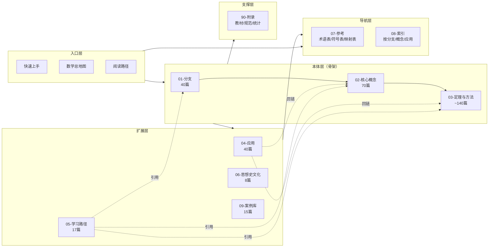

# 知识库说明

## 目标

这个数学子库不是替代教材，而是构建一套可以持续扩写的数学知识结构。  
当前阶段的目标已经从“先搭广度骨架”推进到“围绕高频主线逐步补出可用深度”。

## 组织方式

本子库采用四条并行主线：

1. 数学本体主线
2. 学习路径主线
3. 应用主线
4. 思想、历史、文化主线

其中本体主线是骨架，其余三条线围绕骨架展开并回链。

## 文档类型

- `00-总览`：说明、导航、地图、符号约定
- `01-分支`：各数学分支的总览
- `02-核心概念`：跨分支核心概念
- `03-定理与方法`：定理、方法与证明入口
- `04-应用`：数学如何进入现实问题
- `05-学习路径`：面向不同背景读者的路线
- `06-思想史与文化`：数学如何形成今天的样子
- `09-案例库`：完整建模案例（含代码）
- `90-附录`：参考教材、更新计划与后续结构材料

## 当前可用入口

如果你想尽快进入主题，可以直接从下面几种入口开始：

- 看总图： [数学总地图](./数学总地图.md)
- 看分支： [数学概览](../01-分支/数学概览.md)
- 看核心骨架： [函数](../02-核心概念/函数.md)、[结构](../02-核心概念/结构.md)、[证明](../02-核心概念/证明.md)
- 看分析主线： [极限](../02-核心概念/极限.md)、[连续](../02-核心概念/连续性.md)、[导数](../02-核心概念/导数.md)、[积分](../02-核心概念/积分.md)
- 看线性代数主线： [线性代数](../01-分支/线性代数.md)、[向量空间](../02-核心概念/向量空间.md)、[内积](../02-核心概念/内积.md)、[正交与投影](../02-核心概念/正交性与投影.md)、[范数与正定性](../02-核心概念/范数与正定性.md)
- 看概率统计主线： [随机变量](../02-核心概念/随机变量.md)、[分布](../02-核心概念/概率分布.md)、[期望](../02-核心概念/期望.md)、[方差](../02-核心概念/方差.md)、[条件期望](../02-核心概念/条件期望.md)、[协方差与相关系数](../02-核心概念/协方差与相关.md)、[随机过程](../02-核心概念/随机过程.md)
- 看优化主线： [优化](../01-分支/优化.md)、[凸性](../02-核心概念/凸性.md)、[KKT 条件](../03-定理与方法/05-优化与控制/KKT条件.md)、[优化中的对偶理论](../03-定理与方法/05-优化与控制/优化中的对偶.md)、[线性规划](../03-定理与方法/05-优化与控制/线性规划.md)
- 看离散主线： [图论](../01-分支/图论.md)、[图](../02-核心概念/图.md)、[组合计数](../02-核心概念/组合计数.md)
- 看方法层： [微积分基本定理](../03-定理与方法/01-分析与测度/微积分基本定理.md)、[贝叶斯公式](../03-定理与方法/04-概率与统计/贝叶斯公式.md)、[统计推断概览](../03-定理与方法/04-概率与统计/统计推断概览.md)、[极大似然估计](../03-定理与方法/04-概率与统计/最大似然估计.md)、[假设检验](../03-定理与方法/04-概率与统计/假设检验.md)、[拉格朗日乘子法](../03-定理与方法/05-优化与控制/Lagrange乘子.md)、[KKT 条件](../03-定理与方法/05-优化与控制/KKT条件.md)、[优化中的对偶理论](../03-定理与方法/05-优化与控制/优化中的对偶.md)、[线性规划](../03-定理与方法/05-优化与控制/线性规划.md)、[最小二乘与正规方程](../03-定理与方法/06-数值与计算/最小二乘法与正规方程.md)、[矩阵分解](../03-定理与方法/06-数值与计算/矩阵分解.md)、[梯度下降](../03-定理与方法/05-优化与控制/梯度下降.md)、[马尔可夫链与随机过程](../03-定理与方法/04-概率与统计/Markov链与随机过程.md)
- 看应用： [数据分析中的数学](../04-应用/数据分析中的数学.md)、[控制与优化中的数学](../04-应用/控制与优化中的数学.md)、[机器学习中的数学](../04-应用/机器学习中的数学.md)、[运筹与决策中的数学](../04-应用/运筹学中的数学.md)
- 看思想史： [数学思想](../06-思想史与文化/数学思想.md)
- 看目标导向路线： [广度优先通识路线](../05-学习路径/广度优先通识.md)、[控制、人工智能与运筹交叉路线](../05-学习路径/控制AI与运筹学.md)

## 使用建议

初读时不必追求一次看完全部内容，更稳妥的顺序是：

1. 先看总地图与阅读路径
2. 选一条主线进入
3. 在概念层和方法层之间来回回链
4. 最后再根据应用或思想史扩展视野

## 当前重点

当前版本优先补的是五类内容：

- 概率统计中的条件均值、联合波动、推断与检验
- 线性代数中的范数、正定性与矩阵分解
- 优化中的凸性、KKT、对偶与线性规划
- 随机过程中的马尔可夫结构
- 面向控制、人工智能与运筹的应用桥梁

## 后续扩写原则

- 先补高复用节点，再补边缘分支
- 先补“概念—方法—应用”链路，再补细枝末节
- 让每个新增条目都能明确前置、后续与回链关系
- 尽量把公式写法与几何直觉、数值意义一起补全
