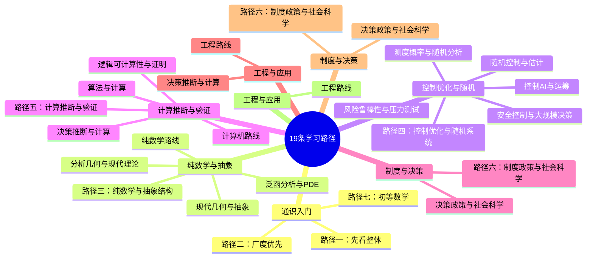

# 阅读路径

## 19条学习路径总览

## 路径一：先看整体

适合第一次进入这个子库的读者。

1. [知识库说明](./知识库指南.md)
2. [数学总地图](./数学总地图.md)
3. [数学概览](../01-分支/数学概览.md)
4. [符号与术语约定](./记号与术语.md)

## 路径二：广度优先

适合尚未确定专业方向，希望先形成整体框架的读者。

- [广度优先通识路线](../05-学习路径/广度优先通识.md)

## 路径七：初等数学

适合想系统重拾中小学数学基础、为高等数学做准备的读者。

- [初等数学路线](../05-学习路径/初等数学.md)

## 路径八：数学建模

适合工程、自然科学和社会科学方向，想学习"将现实问题转化为数学语言"的读者。

- [数学建模路线](../05-学习路径/数学建模.md)

## 路径三：纯数学与抽象结构

适合重视证明、抽象结构与理论统一的读者。

- [纯数学路线](../05-学习路径/纯数学.md)
- [现代理论与抽象结构路线](../05-学习路径/现代几何与抽象.md)
- [分析、几何与现代理论路线](../05-学习路径/分析几何与现代理论.md)
- [泛函分析与偏微分方程路线](../05-学习路径/泛函分析与PDE.md)

## 路径四：控制、优化与随机系统

适合控制、强化学习、运筹、估计、导航、系统工程方向读者。

- [控制、人工智能与运筹交叉路线](../05-学习路径/控制AI与运筹学.md)
- [随机控制与估计路线](../05-学习路径/随机控制与估计.md)
- [测度概率与随机分析路线](../05-学习路径/测度概率与随机分析.md)
- [安全控制与大规模决策路线](../05-学习路径/安全控制与大规模决策.md)
- [风险、鲁棒性与压力测试路线](../05-学习路径/风险鲁棒性与压力测试.md)

## 路径五：计算、推断与验证

适合计算机、人工智能、形式化验证与图模型方向读者。

- [计算机路线](../05-学习路径/计算机科学.md)
- [逻辑、可计算性与证明路线](../05-学习路径/逻辑可计算性与证明.md)
- [决策、推断与计算路线](../05-学习路径/决策推断与计算.md)
- [算法与计算路线](../05-学习路径/算法与计算.md)

## 路径六：制度、政策与社会科学

适合经济学、政策评估、机制设计、社会科学与平台治理方向读者。

- [决策、政策与社会科学路线](../05-学习路径/决策政策与社会科学.md)

## 当前提醒

阅读路径不是学科边界。很多高价值主题正好位于几条路径交叉处，例如：

- 风险度量：统计、优化、金融、安全强化学习
- 高斯图模型：统计、SLAM、图优化、稀疏线性代数
- PDE：分析、物理、控制、材料与连续介质
- 依赖类型：逻辑、程序语义、证明与认证软件
- 网络科学：图论、博弈、控制、多主体系统、平台治理

- 高等数理逻辑：逻辑、可计算性、程序语义、证明助手与数学基础
- 随机分析：概率、泛函分析、PDE、风险决策与连续时间系统的交叉区域

- 测度论：分析、概率、PDE 与风险决策之间的底层统一语言
- 工业工程与供应链：运筹、随机规划、鲁棒优化与机制设计的交叉入口

## 第十六轮新增提醒

- 语言与认知科学不是“数学之外”的主题，它会同时调用概率、图模型、自动机、逻辑、信息论与计算理论
- 排队与服务系统是概率、运筹、鲁棒优化与实时调度的自然交叉点
- 风险决策学习不应停留在平均回报，应同时检查 `CVaR`、约束违例统计与样本外压力测试
