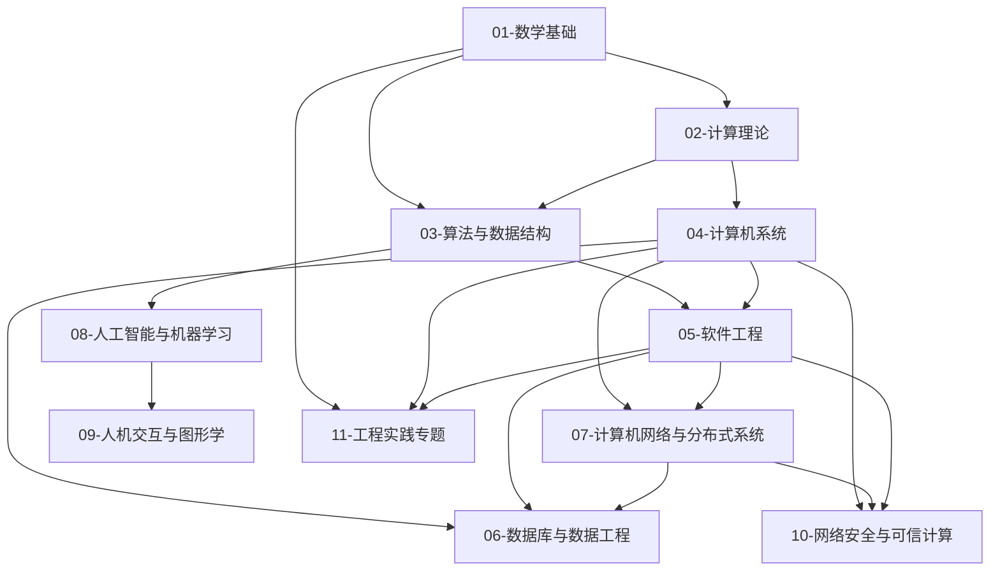

# 学科地图

## 1. 一句话定义

本文档建立计算机科学与工程的整体学科地图，说明各领域的研究对象、核心问题和相互关系。

## 2. 核心问题

- 计算机科学包含哪些主要领域？
- 每个领域解决什么核心问题？
- 领域之间如何关联？

## 3. 学科全景框架

### 3.1 领域总览

| 领域 | 编号 | 核心问题 |
|------|------|----------|
| 数学基础 | 01 | 计算机科学依赖哪些数学工具？ |
| 计算理论 | 02 | 什么是可计算的？计算的极限在哪里？ |
| 算法与数据结构 | 03 | 如何高效地组织和处理数据？ |
| 计算机系统 | 04 | 计算机硬件和系统软件如何工作？ |
| 软件工程 | 05 | 如何高效、可靠地构建大型软件？ |
| 数据库与数据工程 | 06 | 如何持久化、查询和管理大规模数据？ |
| 计算机网络与分布式系统 | 07 | 多台计算机如何通信和协作？ |
| 人工智能与机器学习 | 08 | 如何让计算机从数据中学习和推理？ |
| 人机交互与图形学 | 09 | 人类如何与计算机有效交互？ |
| 网络安全与可信计算 | 10 | 如何保护计算系统和数据的安全？ |
| 工程实践专题 | 11 | 实际工程开发需要掌握哪些工具和技能？ |
| 论文与经典文献 | 12 | 哪些论文和成果奠定了计算机科学的基础？ |
| 学习路线 | 13 | 不同目标的学习者应按什么顺序学习？ |

### 3.2 领域关系图



## 4. 领域依赖关系

### 4.1 基础依赖链

```
数学基础 → 计算理论 → 算法与数据结构 → 计算机系统 → {软件工程, 网络, 数据库, AI, 安全}
```

### 4.2 横向关联

| 领域 | 密切关联 |
|------|----------|
| 算法与数据结构 | 数学基础、计算理论、AI |
| 计算机系统 | 网络、安全、工程实践 |
| 软件工程 | 数据库、网络、工程实践 |
| 人工智能 | 数学基础、算法、工程实践 |
| 网络安全 | 计算机系统、网络、密码学 |

## 5. 如何使用本地图

1. **新人入门**：从 01 数学基础 → 02 计算理论 → 03 算法 → 04 系统，建立底层认知
2. **工程导向**：重点关注 04 系统、05 软件工程、06 数据库、07 网络、11 工程实践
3. **科研导向**：根据研究方向选择对应领域 + 12 论文索引 + 13 学习路线中的研究生路线
4. **面试准备**：重点关注 03 算法、04 系统、05 软件工程

## 6. 待核查问题

- 领域边界划分是否存在更好的替代方案
- 新兴领域（如 AI for Science、神经形态计算）的未来归属
